# DSA/DSC 设计文档

> Dedicated Server Agent (DSA) / Dedicated Server Controller (DSC)
>
> 版本：v0.1 Draft | 日期：2026-04-20

---

## 1. 概述

DSA/DSC 是一套用于管理 UE Dedicated Server（DS）生命周期的分布式组件。核心设计目标：

- **DSA**：运行在每个 Pod 内，以子进程方式拉起、监控、回收 DS 进程
- **DSC**：集中调度控制器，决定将 DS 拉起请求路由到哪个 DSA，并作为外部服务与 DS 之间的通信网关
- **外部服务仅感知 DSC**，无需关心 DSA/DS 的拓扑，降低服务间耦合

### 设计约束

| 约束 | 说明 |
|------|------|
| DS 生命周期 | 一局一个进程，短生命周期（分钟级） |
| 通信频率 | 低频控制指令，非实时帧同步 |
| 规模 | 单 DSA ≤ 50 个 DS；单 DSC ≤ 100 个 DSA |
| 负载维度 | CPU + 内存（两维度量化） |
| 并发控制 | 仅在 DSC 侧执行，DSA 不做并发限制 |
| 通信层 | 基于 libatbus / libatapp |
| 语言 | DSA/DSC/DS/外部服务全部使用 C++ 实现（基于 libatapp / libatbus） |

---

## 2. 术语定义

| 术语 | 全称 | 说明 |
|------|------|------|
| **DS** | Dedicated Server | UE 游戏服务器进程，一局一个，由 DSA 以子进程拉起 |
| **DSA** | Dedicated Server Agent | Pod 内代理，管理本 Pod 所有 DS 子进程 |
| **DSC** | Dedicated Server Controller | 调度控制器，管理同 Region 的 DSA，转发外部服务请求 |
| **Region** | 分组标签 | DSA/DSC 的逻辑分组，用于将 DS 调度到指定的 DSA 集合 |
| **承载系数** | Capacity Coefficient | DSA 启动时指定的 Pod CPU/内存上限，量化为数值 |
| **预分发** | Pre-dispatch | DSC 在发送拉起请求前预扣 DSA 资源，防止并发超载 |
| **Unique ID** | 外部服务唯一标识 | 外部服务连接 DSC 时携带，用于路由和重连 |
| **Seed DS** | 种子进程 | 以 `--ds-seed` 启动的 DS 进程，预加载引擎与资源后等待 fork 指令 |
| **DSM** | Dedicated Server Manager | 全局管理进程，提供 Web UI / REST API，统一管控所有 Region 的 DSA/DSC |

---

## 3. 架构总览

### 3.1 组件关系图

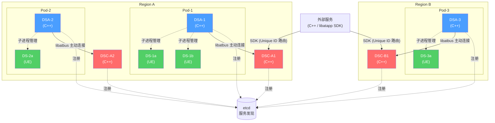
```mermaid
graph TB
    subgraph "Region A"
        subgraph "Pod-1"
            DSA1["DSA-1<br/>(C++)"]
            DS1a["DS-1a<br/>(UE)"]
            DS1b["DS-1b<br/>(UE)"]
            DSA1 -.->|子进程管理| DS1a
            DSA1 -.->|子进程管理| DS1b
        end

        subgraph "Pod-2"
            DSA2["DSA-2<br/>(C++)"]
            DS2a["DS-2a<br/>(UE)"]
            DSA2 -.->|子进程管理| DS2a
        end

        DSC_A1["DSC-A1<br/>(C++)"]
        DSC_A2["DSC-A2<br/>(C++)"]

        DSA1 -->|libatbus 主动连接| DSC_A1
        DSA2 -->|libatbus 主动连接| DSC_A2
    end

    subgraph "Region B"
        subgraph "Pod-3"
            DSA3["DSA-3<br/>(C++)"]
            DS3a["DS-3a<br/>(UE)"]
            DSA3 -.->|子进程管理| DS3a
        end

        DSC_B1["DSC-B1<br/>(C++)"]

        DSA3 -->|libatbus 主动连接| DSC_B1
    end

    ExtSvc["外部服务<br/>(C++ / libatapp SDK)"]

    ExtSvc -->|"SDK (Unique ID 路由)"| DSC_A1
    ExtSvc -->|"SDK (Unique ID 路由)"| DSC_B1

    etcd[("etcd<br/>服务发现")]
    DSA1 -.->|注册| etcd
    DSA2 -.->|注册| etcd
    DSA3 -.->|注册| etcd
    DSC_A1 -.->|注册| etcd
    DSC_A2 -.->|注册| etcd
    DSC_B1 -.->|注册| etcd

    style DSA1 fill:#4a9eff,color:#fff
    style DSA2 fill:#4a9eff,color:#fff
    style DSA3 fill:#4a9eff,color:#fff
    style DSC_A1 fill:#ff6b6b,color:#fff
    style DSC_A2 fill:#ff6b6b,color:#fff
    style DSC_B1 fill:#ff6b6b,color:#fff
    style DS1a fill:#51cf66,color:#fff
    style DS1b fill:#51cf66,color:#fff
    style DS2a fill:#51cf66,color:#fff
    style DS3a fill:#51cf66,color:#fff
```

### 3.2 核心数据流

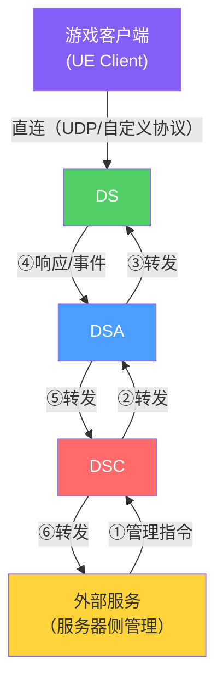
```mermaid
graph TB
    GameClient["游戏客户端<br/>(UE Client)"] -->|"直连（UDP/自定义协议）"| DS

    ExtSvc["外部服务<br/>（服务器侧管理）"] -->|"①管理指令"| DSC
    DSC -->|"②转发"| DSA
    DSA -->|"③转发"| DS

    DS -->|"④响应/事件"| DSA
    DSA -->|"⑤转发"| DSC
    DSC -->|"⑥转发"| ExtSvc

    style GameClient fill:#845ef7,color:#fff
    style ExtSvc fill:#ffd43b,color:#333
    style DSC fill:#ff6b6b,color:#fff
    style DSA fill:#4a9eff,color:#fff
    style DS fill:#51cf66,color:#fff
```

> **两条独立数据面**：
> - **管理面（三跳）**：外部服务 ↔ DSC ↔ DSA ↔ DS，用于低频控制指令（房间管理、状态通知等）
> - **游戏面（直连）**：游戏客户端直连 DS，不经过 DSC/DSA，用于帧同步等高频数据
>
> DS 拉起完成后，DSC 回包中会包含 DS 的客户端连接地址，外部服务（如 lobbysvr）将此地址下发给游戏客户端。
>
> DS **不感知 DSC 的存在**，仅与 DSA 建立本地通信。外部服务**仅感知 DSC**，不关心 DSA/DS 拓扑。

### 3.3 连接方向总结

| 发起方 | 接收方 | 方式 | 说明 |
|--------|--------|------|------|
| DSA | DSC | libatbus 主动连接 | DSA 启动后通过服务发现筛选同 Region DSC，随机选定一个建连 |
| 外部服务 | DSC | libatapp SDK | 首次随机选择指定 Region 的 DSC，后续固定连接同一 DSC（SDK 本地记录） |
| 游戏客户端 | DS | 直连（UDP/自定义） | 拉起 DS 后由外部服务将 DS 地址下发给游戏客户端 |
| DSA | DS | 进程管道/本地 socket | DSA 作为父进程与 DS 子进程通信 |
| DSC | DSA | N/A | DSC 不主动连接 DSA；DSA 断线则清除状态 |

---

## 4. DSA (Dedicated Server Agent) 详细设计

### 4.1 部署模型

- 每个 K8s Pod 启动**一个 DSA 进程**作为主进程
- DSA 以**子进程**方式拉起多个 DS 实例（一局一个进程）
- DSA 数量随 Pod 水平扩缩容自动增减
- Pod 被销毁时 DSA 随之销毁，DSC 侧感知断线并清理

### 4.2 启动参数与配置

| 参数 | 类型 | 说明 |
|------|------|------|
| `cpu_capacity` | float64 | Pod CPU 承载上限（量化值，如 10.0 表示 10 核） |
| `memory_capacity` | float64 | Pod 内存承载上限（量化值，单位 MB） |
| `regions` | []string | 所属 Region 列表（可多个），启动后不可变 |
| `memory_kill_threshold` | float64 | Pod 内存使用超过此值时强制 Kill DS（OOM 保护） |
| `ds_binary_path` | string | DS 可执行文件路径 |
| `ds_preset_args` | string[] | DS 进程预设启动参数 |
| `heartbeat_interval` | duration | DS 心跳检测间隔 |
| `heartbeat_timeout` | duration | 心跳超时阈值，超过则判定为死循环 |
| `seed_mode` | bool | 是否启用种子进程模式（详见 §4.9） |
| `seed_count` | int | 种子进程数量（默认 1） |

### 4.3 容量管理

DSA 维护 Pod 级别的资源账本，核心思路是 **预期值 + 实际修正**：

```
可用 CPU = cpu_capacity - Σ(各 DS 的有效 CPU 消耗)
可用内存 = memory_capacity - Σ(各 DS 的有效内存消耗)
```

**有效消耗计算**：

```
有效 CPU 消耗 = max(预期 CPU, 实际 CPU)
有效内存消耗 = max(预期内存, 实际内存)
```

> 这解决了"热点消耗延后"问题：当实际消耗超过预期时，自动缩减可用容量。
>
> 例：Pod 上限 10 CPU，预期每 DS 1 CPU，但实际各占 1.5 CPU → 可用容量仅够 6 个 DS。

**OOM 保护**：DSA 定期检查 Pod 内存总使用量，超过 `memory_kill_threshold` 时按策略 Kill DS（优先 Kill 内存最大的 DS）。

### 4.4 DS 进程管理

#### 4.4.1 拉起 DS

```cpp
// 伪代码：DSA 拉起 DS
ErrorCode DSAgent::StartDS(const StartDSRequest& req, StartDSResponse* rsp) {
    // 1. 检查资源是否充足
    if (available_cpu_ < req.expected_cpu() || available_memory_ < req.expected_memory()) {
        return kErrInsufficientCapacity;
    }

    // 2. 预扣资源
    ReserveCapacity(req.expected_cpu(), req.expected_memory());

    // 3. 构建启动参数 = 预设参数 + 拉起方自定义参数
    std::vector<std::string> args = preset_args_;
    args.insert(args.end(), req.custom_args().begin(), req.custom_args().end());

    pid_t pid = -1;
    if (seed_mode_ && active_seed_ && active_seed_->state == SeedState::kReady) {
        // 4a. 种子模式：向 Seed DS 发送 ForkReq（详见 §4.9）
        pid = SeedFork(active_seed_, req);
    } else {
        // 4b. 普通模式：fork + exec 拉起 DS 子进程
        pid = LaunchChildProcess(ds_binary_path_, args);
    }

    if (pid <= 0) {
        ReleaseCapacity(req.expected_cpu(), req.expected_memory());
        return kErrLaunchFailed;
    }

    // 5. 建立通信通道（本地 socket / pipe）
    auto ds = RegisterDS(pid, req);

    // 6. 启动心跳检测
    ds->StartHeartbeatMonitor();

    rsp->set_ds_id(ds->id());
    return kOK;
}
```

启动参数来源：
- **预设 Args**：DSA 配置中指定，所有 DS 共用
- **自定义 Args**：由拉起方（通过 DSC 转发）传入，每局不同

#### 4.4.2 DS 数据结构

```cpp
enum class DSState : int32_t {
    kRunning  = 0,
    kExiting  = 1,   // DS 已调用 SDK 通知即将退出
    kExited   = 2,   // 进程已退出
};

enum class DSExitReason : int32_t {
    kUnknown          = 0,
    kNormal           = 1,  // DS 主动调用 SDK 退出
    kCrash            = 2,  // 进程异常退出（非零退出码）
    kHeartbeatTimeout = 3,  // 心跳超时（疑似死循环）
    kOOMKill          = 4,  // DSA 内存保护触发强杀
};

struct DSInstance {
    uint64_t     id;              // DS 唯一标识（DSA 分配）
    pid_t        pid;             // 操作系统进程 ID
    DSState      state;           // Running / Exiting / Exited
    double       expected_cpu;    // 拉起时预期 CPU
    double       expected_memory; // 拉起时预期内存
    double       actual_cpu;      // 实际 CPU（定期采集）
    double       actual_memory;   // 实际内存（定期采集）
    int64_t      start_time;      // 启动时间戳
    DSExitReason exit_reason;     // 退出原因
    std::string  client_addr;     // 客户端连接地址
    std::string  binary_version;  // DS 二进制版本（滚动更新用，详见 §4.10）
};
```

### 4.5 DS 退出检测

DSA 需要区分多种退出场景：

| 退出场景 | 检测方式 | DSA 行为 |
|----------|----------|----------|
| **正常退出** | DS 调用 SDK `NotifyExit(data)` → 进程退出 | 接收退出数据，释放资源，通知 DSC |
| **Crash** | `Process.Wait()` 返回非零退出码，且未收到 SDK 通知 | 记录退出码，释放资源，通知 DSC |
| **死循环（心跳超时）** | 心跳探测超过 `heartbeat_timeout` 无响应 | Kill 进程，释放资源，通知 DSC |
| **OOM 保护** | Pod 内存超过 `memory_kill_threshold` | Kill 内存最大的 DS，释放资源，通知 DSC |

> Crash Dump 的采集与分析由业务侧自行处理，DSA 不介入。

### 4.6 心跳机制

DS 进程作为主动方，定期向 DSA 发送心跳；DSA 侧监控心跳间隔，超时则判定异常。

```
DSA                    DS
 │                      │
 │<── HeartbeatReq ─────│  (DS 主动发送心跳，携带自身负载数据)
 │                      │
 │── HeartbeatRsp ──────>│  (DSA 确认心跳，可携带控制指令)
 │                      │
 │<── HeartbeatReq ─────│  (下一个心跳周期)
 │                      │
 │  heartbeat_timeout   │  (DS 进入死循环，停止发送心跳)
 │  已超时未收到心跳    │
 │                      │
 │── Kill Process ──────>│  (DSA 强杀进程)
```

- DS 通过 SDK 定期主动向 DSA 发送心跳（每次携带 CPU/内存使用量）
- DSA 监控上次收到心跳的时间，超过 `heartbeat_timeout` 无心跳则判定为死循环
- 判定超时后 DSA 强杀 DS 进程，上报 HeartbeatTimeout 退出原因
- 心跳数据（CPU/内存）用于 DSA 更新 DS 的实际资源消耗

### 4.7 与 DSC 的通信

DSA 启动后：
1. 通过 etcd 服务发现，按 Region 属性筛选可用 DSC
2. 选定一个 DSC，通过 libatbus 主动建立连接
3. 上报自身属性（容量、Region 列表、当前负载）
4. 持续上报负载变化和 DS 状态变更

**DSA → DSC 上报内容**：

| 上报项 | 触发时机 | 说明 |
|--------|----------|------|
| DSA 注册 | 连接建立时 | 容量系数、Region 列表、当前 DS 列表 |
| DS 启动完成 | DS 子进程启动成功 | DS ID、关联 Unique ID |
| DS 退出 | DS 进程退出 | DS ID、退出原因、退出数据 |
| 负载更新 | 定期 / 变化时 | 当前 CPU/内存使用、可用容量、DS 数量 |
| 转发消息 | DS 发送数据时 | DS ID、消息内容 |

### 4.8 指标上报

| 指标名 | 类型 | 说明 |
|--------|------|------|
| `dsa_ds_count` | Gauge | 当前管理的 DS 数量 |
| `dsa_cpu_used` | Gauge | 当前 CPU 使用量 |
| `dsa_cpu_capacity` | Gauge | CPU 承载上限 |
| `dsa_memory_used` | Gauge | 当前内存使用量 |
| `dsa_memory_capacity` | Gauge | 内存承载上限 |
| `dsa_ds_start_total` | Counter | DS 拉起总次数 |
| `dsa_ds_exit_total` | Counter | DS 退出总次数（按退出原因分标签） |
| `dsa_ds_start_duration` | Histogram | DS 启动耗时 |
| `dsa_heartbeat_timeout_total` | Counter | 心跳超时次数 |
| `dsa_oom_kill_total` | Counter | OOM 保护触发次数 |

### 4.9 Seed 模式（种子进程）

Seed 模式通过预加载 + `fork()` 实现 DS 毫秒级拉起。DSA 在启动时拉起一个或多个**种子 DS（Seed DS）**，种子进程完成引擎和资源的预加载后进入等待状态；后续分配 DS 时，DSA 向种子进程发送 Fork 指令，种子进程调用 `fork()` 产生子 DS，子 DS 继承父进程的内存页（Copy-on-Write），几乎零开销完成启动。

#### 4.9.1 工作流程

```
DSA 启动
  │
  ├──► 拉起 Seed DS（ds_binary --ds-seed --ds-seed-id=1）
  │     Seed DS 加载引擎 + 资源 → 进入 Seed Loop
  │
  │  ← 收到 StartDSReq
  │
  ├──► 向 Seed DS 发送 SeedForkReq(ds_id, custom_args, listen_port)
  │     Seed DS: fork()
  │       ├── 父进程：返回子 PID，继续 Seed Loop
  │       └── 子进程：执行正常 DS 初始化（绑定端口、注册心跳）
  │
  │  ← Seed DS 回复 SeedForkRsp(child_pid)
  │  ← 子 DS 通过 SDK Init 注册到 DSA
  │
  └──► 后续流程与普通模式相同
```

#### 4.9.2 DSA Seed 配置

| 参数 | 类型 | 说明 |
|------|------|------|
| `seed_mode` | bool | 是否启用种子模式 |
| `seed_count` | int | 种子进程数量（默认 1，大流量可开多个分摊 fork 压力） |
| `seed_args` | string[] | 种子进程专用启动参数（追加在 `ds_preset_args` 之后） |
| `seed_ready_timeout` | duration | 种子进程启动超时（加载引擎 + 资源的时间上限） |

#### 4.9.3 种子进程生命周期

```
                 ┌──────────────────────────────────┐
                 │  Seed DS 状态机                   │
                 │                                  │
   DSA 拉起 ──► │  Loading ──► SeedReady ◄─── fork  │
                 │     │            │    (回到 Ready) │
                 │     ▼            ▼                │
                 │   Failed     Draining ──► Stopped │
                 └──────────────────────────────────┘
```

| 状态 | 说明 |
|------|------|
| **Loading** | 种子进程启动中，正在加载引擎和资源 |
| **SeedReady** | 预加载完成，等待 Fork 指令 |
| **Draining** | 滚动更新时标记为 Draining，不再接受新 Fork；等待所有已 fork 子 DS 退出 |
| **Stopped** | 种子进程已停止（主动退出或被 DSA Kill） |
| **Failed** | 种子进程启动失败（超时或 Crash） |

#### 4.9.4 DS SDK Seed 接口设计（C++）

DS 侧需要在 SDK 中实现种子模式支持：

```cpp
// ds_agent_sdk.h — DS 侧 SDK 头文件

class IDSAgentSDK {
public:
    virtual ~IDSAgentSDK() = default;

    // ========== 通用接口（普通模式 + Fork 子进程均使用）==========

    /// 初始化 SDK，连接 DSA（子进程 fork 后调用）
    /// @param socket_path DSA 通信 socket 路径（由启动参数或环境变量传入）
    virtual ErrorCode Init(const std::string& socket_path) = 0;

    /// 发送心跳（由 DS 定期调用，携带自身负载数据）
    virtual void SendHeartbeat(float cpu_usage, float memory_usage_mb) = 0;

    /// 通知即将退出
    virtual void NotifyExit(const std::vector<uint8_t>& user_data) = 0;

    /// 向外部服务发送数据
    virtual void SendToExternal(const std::vector<uint8_t>& data) = 0;

    /// 注册消息回调
    virtual void OnMessageFromExternal(
        std::function<void(const std::vector<uint8_t>&)> cb) = 0;

    // ========== 种子模式专用接口 ==========

    /// 进入种子等待循环（仅种子进程调用）
    /// 内部循环：等待 DSA 的 ForkReq → fork() → 父进程继续循环，子进程返回
    /// @return 子进程返回 fork 参数；父进程永不返回
    virtual SeedForkResult EnterSeedLoop() = 0;

    /// 判断当前是否为种子模式（检查 --ds-seed 启动参数）
    static bool IsSeedMode(int argc, char** argv);

    /// 获取种子 ID（--ds-seed-id 参数值）
    static int GetSeedId(int argc, char** argv);
};

/// Fork 后子进程收到的参数
struct SeedForkResult {
    uint64_t    ds_id;          // DSA 分配的 DS ID
    uint16_t    listen_port;    // 子 DS 应绑定的客户端端口
    std::string socket_path;    // 子 DS 与 DSA 通信的 socket 路径
    std::vector<std::string> custom_args;  // 业务自定义参数
};
```

#### 4.9.5 UE Dedicated Server 集成示例

```cpp
// UE DS Main 入口（简化示意）
int main(int argc, char** argv) {
    if (IDSAgentSDK::IsSeedMode(argc, argv)) {
        // ====== 种子模式 ======

        // 1. 最小化引擎初始化（加载模块、资源到内存，不启动游戏线程）
        FEngineLoop::PreInitPreStartupScreen(argc, argv);
        // 预加载常用 Pak / Asset（触发 OS 页缓存，fork 后 CoW 共享）
        PreloadGameAssets();

        // 2. 连接 DSA，进入种子等待循环
        auto sdk = CreateDSAgentSDK();
        SeedForkResult result = sdk->EnterSeedLoop();
        // ↑ 父进程永不返回；子进程从这里继续

        // 3. 子进程：应用 fork 参数，继续正常 UE 启动
        ApplyForkArgs(result);  // 设置监听端口等
        FEngineLoop::Init();    // 完整引擎初始化（创建线程、绑定端口等）

        // 4. 正常游戏循环
        sdk->Init(result.socket_path);
        RunGameLoop(sdk);

    } else {
        // ====== 普通模式（非种子）======
        return GuardedMain(argc, argv);
    }
}
```

**UE 特别注意事项**：

| 事项 | 说明 |
|------|------|
| **fork 时机** | 必须在 UE 创建渲染线程、TaskGraph 线程之前 fork；否则子进程继承的线程状态不一致 |
| **GPU 资源** | DS 通常为 headless 模式（`-nullrhi`），不涉及 GPU；若有 GPU 需求，fork 前不可初始化 |
| **文件描述符** | fork 后子进程继承父进程所有 fd；DSA socket 需在子进程中重新建立连接 |
| **内存收益** | UE DS 进程通常占用 500MB~2GB；种子模式下引擎 + 公共资源为只读页，fork 后 CoW 共享，每个子 DS 仅消耗增量内存 |
| **信号处理** | 子进程需重新注册信号处理函数（SIGTERM / SIGCHLD 等） |

#### 4.9.6 种子进程崩溃恢复

| 场景 | DSA 行为 |
|------|----------|
| 种子进程启动超时 | 记录错误，回退到普通模式（fork+exec 拉起） |
| 种子进程 Crash | 自动重新拉起种子进程；期间新请求走普通模式 |
| Fork 失败（如内存不足） | 返回错误给 DSC；DSC 可选择其他 DSA 重试 |
| 所有种子进程忙（fork 未返回） | 排队等待或回退到普通模式 |

### 4.10 DS 滚动更新

DS 二进制更新时需要做到：**不重启 DSA Pod，不影响正在运行的旧 DS**。

#### 4.10.1 更新策略

```
时间线 ──────────────────────────────────────────────►

DSA Pod（不重启）
  │
  ├── ds_binary v1 (/app/ds/v1/GameServer)
  │     ├── Seed DS (v1)    ← 标记 Draining
  │     ├── DS-001 (v1)     ← 继续运行直到局结束
  │     └── DS-002 (v1)     ← 继续运行直到局结束
  │
  │  ← UpdateDSBinary 指令（新版本 v2 路径）
  │
  ├── ds_binary v2 (/app/ds/v2/GameServer)
  │     ├── Seed DS (v2)    ← 新拉起
  │     ├── DS-003 (v2)     ← 新分配使用 v2
  │     └── DS-004 (v2)     ← 新分配使用 v2
  │
  │  ← v1 所有 DS 退出后
  │
  └── 清理 v1 目录，v1 Seed DS 退出
```

#### 4.10.2 版本管理数据结构

```cpp
struct DSBinaryVersion {
    std::string  version;        // 版本标识（如 "v1.2.3"）
    std::string  binary_path;    // 可执行文件路径
    bool         is_active;      // 是否接受新分配
    int32_t      running_count;  // 当前运行中的 DS 数量
    SeedDS*      seed;           // 关联的种子进程（Seed 模式下）
};

// DSA 同时持有多个版本
std::vector<DSBinaryVersion> ds_versions_;
// active_version_ 指向当前接受新分配的版本
DSBinaryVersion* active_version_ = nullptr;
```

#### 4.10.3 更新流程

| 步骤 | DSA 行为 | 说明 |
|------|----------|------|
| 1 | 收到 `UpdateDSBinary` 指令（含新版本路径） | 由 DSM 或运维工具触发 |
| 2 | 校验新二进制（路径存在、可执行） | 预检查 |
| 3 | 旧版本标记为 `is_active = false` | 不再接受新 DS 分配 |
| 4 | Seed 模式下：旧 Seed DS 标记 Draining | 不再接受 Fork |
| 5 | 创建新版本条目，`is_active = true` | 新 DS 使用新二进制 |
| 6 | Seed 模式下：拉起新版本的 Seed DS | 等待 SeedReady |
| 7 | 后续 StartDS / Fork 请求走新版本 | 新局使用新二进制 |
| 8 | 旧版本 `running_count` 降为 0 | 所有旧局自然结束 |
| 9 | 旧 Seed DS 退出，清理旧版本条目 | 更新完成 |

#### 4.10.4 二进制分发方式

| 方式 | 适用场景 | 说明 |
|------|----------|------|
| **共享存储（PV/NFS）** | 推荐 | DS 二进制存放在共享卷，更新时上传新版本到版本化路径 |
| **InitContainer 预拉取** | 简单场景 | 新版本 DS 打包为镜像，通过 sidecar/init 容器拉取到 emptyDir |
| **DSM 推送** | 集中管理 | DSM 通过 DSC → DSA 管理面下发更新指令，DSA 从对象存储拉取 |

#### 4.10.5 回滚

如果新版本出现问题（如 Seed 启动失败、DS 频繁 Crash）：

1. DSM / 运维发送回滚指令
2. DSA 将新版本标记为 `is_active = false`，新 Seed 标记 Draining
3. 恢复旧版本为 active（如果旧版本 Seed 仍存活且有旧二进制）
4. 如果旧版本已清理，则需要重新部署旧二进制并拉起 Seed

---

## 5. DSC (Dedicated Server Controller) 详细设计

### 5.1 部署模型

- DSC 为独立部署的 C++ 服务（基于 libatapp），**数量手动控制，不自动扩缩容**
- 每个 DSC 配置所属 Region，仅管理同 Region 的 DSA
- 同一 Region 可部署多个 DSC 实现负载分担
- DSC 之间**无状态共享**，各自管理连接到自己的 DSA

### 5.2 服务发现与 DSA 管理

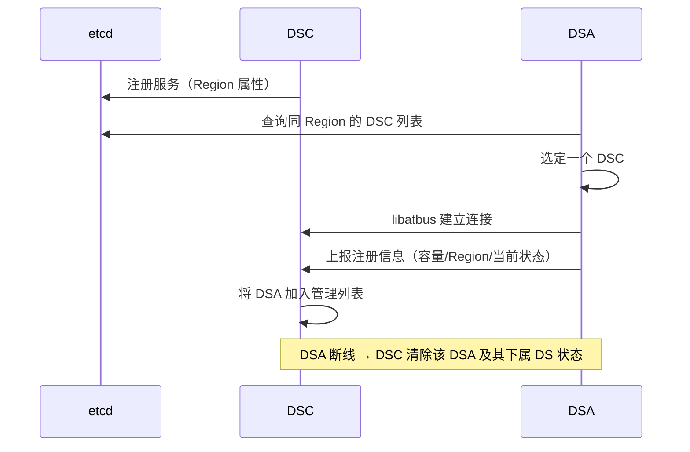
```mermaid
sequenceDiagram
    participant etcd as etcd
    participant DSC as DSC
    participant DSA as DSA

    DSC->>etcd: 注册服务（Region 属性）
    DSA->>etcd: 查询同 Region 的 DSC 列表
    DSA->>DSA: 选定一个 DSC
    DSA->>DSC: libatbus 建立连接
    DSA->>DSC: 上报注册信息（容量/Region/当前状态）
    DSC->>DSC: 将 DSA 加入管理列表

    Note over DSC,DSA: DSA 断线 → DSC 清除该 DSA 及其下属 DS 状态
```

**DSA 断线处理**：
- DSC 不对 DSA 断线做重连（DSA 可能被 K8s 销毁）
- 断线立即清除该 DSA 的所有状态（DSA 信息、其下所有 DS 信息）
- 如果 DSA 重新启动（新 Pod），视为全新 DSA 重新连接

### 5.3 调度算法

DSC 收到 DS 拉起请求时，需要选择最优 DSA：

```
输入：Region、预期 CPU、预期内存
输出：目标 DSA

算法：
1. 筛选：Region 匹配 且 连接正常 的 DSA 列表
2. 资源过滤：可用 CPU ≥ 预期 CPU 且 可用内存 ≥ 预期内存
3. 并发过滤：该 DSA 当前 in-flight 拉起数 < 并发上限
4. 排序策略：按可用资源比例降序（优先选择空闲率最高的 DSA）
5. 选择：取排序后第一个
```

> 排序策略可扩展为加权评分：`score = w1 * cpu_avail_ratio + w2 * mem_avail_ratio`

### 5.4 并发控制（预分发）

并发控制的目的是防止短时间内向同一 DSA 发送过多拉起请求（DS 启动有延迟，资源上报存在时间差）。

**机制**：

```
DSC 维护每个 DSA 的 in-flight 计数器：
  - 发送拉起请求时 +1，预扣资源
  - 收到拉起完成/失败回包时 -1，确认资源
  - DSA 断线时归零
```

**配置**：

| 参数 | 说明 |
|------|------|
| `max_inflight_per_dsa` | 单个 DSA 最大 in-flight 拉起数 |
| `inflight_timeout` | in-flight 超时时间，超时自动回收 |

### 5.5 路由与会话管理

#### 5.5.1 Unique ID 路由

外部服务通过 SDK 连接 DSC 时携带自身的 Unique ID（uint64）。路由策略如下：

**首次连接：**
1. SDK 通过服务发现获取指定 Region 下所有可用 DSC 列表
2. 从列表中**随机选择**一个 DSC 建立连接
3. SDK 本地记录所选 DSC 的地址

**后续连接（包括断线重连）：**
1. SDK 优先重连到之前记录的同一 DSC（固定到同一 DSC）
2. 若该 DSC 不可用（极少数情况）则连接失败，等待运维处理

> DSC 数量手动控制且几乎不故障，SDK 存储的 DSC 地址需要在服务终止时淘汰，下次启动时重新随机选择。

#### 5.5.2 会话表

DSC 维护 Unique ID 与 DS 的映射关系。

**ID 体系说明**：
- `UniqueID`：外部服务的自身标识（uint64），外部服务连接 DSC 时携带，DSA/DS 不知道这个 ID
- `DSA_ID`：DSA 全局唯一标识（uint64，由系统/etcd 分配）
- `DS_ID`：DS 局部标识（uint64，由 DSA 分配，在该 DSA 内唯一）
- `DSCompositeKey{DSA_ID, DS_ID}`：DS 全局唯一标识，DSC 将此复合 ID 返回给外部服务

**ID 流转过程**：
```
DSA 启动 DS
  │ DSA 内部分配 DS_ID
  │ DS 进程通过 SDK 向 DSA 注册
  ↓
DSA 将 (DSA_ID, DS_ID) 上报给 DSC
DSC 建立映射：UniqueID → [(DSA_ID, DS_ID), ...]
DSC 将 (DSA_ID, DS_ID) 返回给外部服务
  ↓
外部服务保存 (DSA_ID, DS_ID)——用于后续指定目标 DS 发送消息
```

```cpp
struct DSCompositeKey {
    uint64_t dsa_id;
    uint64_t ds_id;

    bool operator==(const DSCompositeKey& o) const {
        return dsa_id == o.dsa_id && ds_id == o.ds_id;
    }
};

struct DSCompositeKeyHash {
    size_t operator()(const DSCompositeKey& k) const {
        return std::hash<uint64_t>()(k.dsa_id) ^
               (std::hash<uint64_t>()(k.ds_id) << 32);
    }
};

struct ExternalSession {
    uint64_t     unique_id;      // 外部服务自身标识
    void*        conn_handle;    // libatbus 连接句柄
    SessionState state;
    // 该外部服务关联的所有 DS（可多个，跨 Region）
    std::vector<DSCompositeKey> ds_list;
    // 待发消息缓冲（外部服务离线时暂存）
    std::deque<std::unique_ptr<PendingMessage>> pending_msgs;
};

struct DSSession {
    DSCompositeKey key;        // (DSA_ID, DS_ID)
    uint64_t       owner_uid;  // 归属的外部服务 UniqueID
};

// DSC 全局会话表
struct SessionTable {
    // UniqueID → ExternalSession
    std::unordered_map<uint64_t, std::unique_ptr<ExternalSession>> by_unique_id;
    // (DSA_ID, DS_ID) → DSSession（反向查找）
    std::unordered_map<DSCompositeKey, std::unique_ptr<DSSession>,
                       DSCompositeKeyHash> by_ds_key;
};
```

**访问控制**：只有建立该 DS 的 UniqueID 才能与该 DS 通信，DSC 在转发时校验。

#### 5.5.3 Unique ID 重复处理

当同一 Unique ID 再次连接（旧节点 Crash 后重连）：

```
1. 新连接到达，携带 Unique ID
2. DSC 检查是否已有该 Unique ID 的活跃连接
   a. 旧连接已断开 → 接受新连接，继承已有的 DS 映射
   b. 旧连接仍存活 → 拒绝新连接（连接失败）
3. 连接建立后，DSC 不会主动断开
```

### 5.6 通信转发

DSC 作为中间层转发外部服务与 DS 之间的消息：

**下行（外部服务 → DS）**：

```
外部服务 → DSC: SendToDS(UniqueID, Data)
DSC: 查找 UniqueID → (DSAID, DSID)，校验权限
DSC → DSA: Forward(DSID, Data)
DSA → DS: Deliver(Data)
```

**上行（DS → 外部服务）**：

```
DS → DSA: SendData(Data)
DSA → DSC: Forward(DSID, Data)
DSC: 查找 DSID → UniqueID
DSC → 外部服务: Deliver(UniqueID, Data)
```

### 5.7 外部服务 SDK 设计

外部服务使用 C++ SDK（基于 libatapp），SDK 封装以下能力：

| SDK 接口 | 说明 |
|----------|------|
| `Connect(dsc_region, unique_id)` | 连接指定 Region 的 DSC，携带自身 UniqueID |
| `LaunchDS(region, params) → (dsa_id, ds_id, client_addr)` | 请求拉起 DS，返回 DSA ID、DS ID 以及客户端连接地址 |
| `SendToDS(dsa_id, ds_id, data)` | 向指定的 DS 发送数据（一个外部服务可拥有多个 DS） |
| `OnDSMessage(dsa_id, ds_id, callback)` | 注册指定 DS 的消息回调 |
| `OnDSExited(callback)` | 注册 DS 退出回调（含退出原因和数据） |
| `Disconnect()` | 断开与 DSC 的连接 |

SDK 内部通过本地存储的 DSC 地址保证同一外部服务实例始终连接到同一台 DSC。

> **参数说明**：`SendToDS` 需要明确传入 `dsa_id` 和 `ds_id`，因为一个外部服务可以跨多个 Region 拥有多个 DS，需明确指定目标。

### 5.8 消息可靠传输

DS 与外部服务之间的消息需要可靠传输保证。外部服务和 DS 层无需自己处理重传策略，仅会看到「发送超时」或「成功」两种结果。

#### 5.8.1 ACK 机制

每条业务消息在 Protobuf 包装内携带序列号 `seq`：

| 角色 | 行为 |
|------|------|
| 发送方 | 发送消息，已发送且未收到 ACK 的消息加入待确认队列 |
| 接收方 | 收到消息后立即回复 ACK（含 seq） |
| 发送方 | 收到 ACK 后从待确认队列移除 |
| 发送方 | 超过单次重传间隔则重发（至多 N 次） |
| 发送方 | 超过总超时（所有重试就捨）则返回错误给调用方 |

#### 5.8.2 外部服务离线内存缓冲应对方案

**上行（DS → 外部服务）离线容灾**：

```
 DS 发送消息
  ↓
 DSC 收到消息，发现外部服务离线
  ↓
 DSC 将消息写入内存上行缓冲队列（按 UniqueID 分区）
 DSC 回复 DS 的 ACK（确认尤小高已收到）
  ↓
 外部服务重连时携带 last_received_seq
  ↓
 DSC 从 last_received_seq+1 开始重放缓冲消息
  ↓
 外部服务收到并 ACK，DSC 清空已确认的缓冲
```

**下行（外部服务 → DS）访问失败**：
- 如果 DS 已退出则返回错误（不缓冲）
- 如果 DSA 离线则返回错误（不缓冲）
- 外部服务只会收到超时或错误结果

#### 5.8.3 缓冲容量限制

| 参数 | 说明 |
|------|------|
| `max_pending_per_session` | 单个外部服务上行缓冲上限 |
| `pending_ttl` | 缓冲消息最长保留时间，超时丢弃 |
| `ack_timeout` | 单次消息 ACK 等待超时 |
| `max_retry` | 最大重试次数 |

### 5.9 指标上报

| 指标名 | 类型 | 说明 |
|--------|------|------|
| `dsc_dsa_count` | Gauge | 当前管理的 DSA 数量 |
| `dsc_ds_total_count` | Gauge | 当前管理的 DS 总数 |
| `dsc_session_count` | Gauge | 活跃会话数 |
| `dsc_launch_request_total` | Counter | DS 拉起请求总数 |
| `dsc_launch_success_total` | Counter | DS 拉起成功总数 |
| `dsc_launch_fail_total` | Counter | DS 拉起失败总数（按原因分标签） |
| `dsc_launch_duration` | Histogram | DS 拉起请求端到端耗时 |
| `dsc_forward_message_total` | Counter | 转发消息总数（按方向分标签） |
| `dsc_inflight_count` | Gauge | 当前 in-flight 拉起数 |
| `dsc_dsa_disconnect_total` | Counter | DSA 断线次数 |

---

## 6. 通信协议设计

### 6.1 DSA ↔ DS (本地通信)

DS 通过 C++ SDK 与 DSA 建立本地通信（进程间管道或本地 Unix Socket）。

> **全部通信使用 Protobuf 封装**，以长度前缀帧转载。

```protobuf
// DS → DSA
message DSToAgent {
    oneof payload {
        DSHeartbeatReq      heartbeat_req  = 1;   // DS 主动发心跳
        DSHeartbeatAck      heartbeat_ack  = 2;   // 对 DSA heartbeat_rsp 的确认
        DSNotifyExit        notify_exit    = 3;   // 即将退出通知
        DSForwardToExternal forward        = 4;   // 转发给外部服务的数据
        ForwardAck          forward_ack    = 5;   // 对收到的下行消息 ACK
        SeedReady           seed_ready     = 10;  // 种子进程就绪通知
        SeedForkRsp         seed_fork_rsp  = 11;  // 种子 fork 结果回复
    }
}

// DSA → DS
message AgentToDS {
    oneof payload {
        DSHeartbeatRsp       heartbeat_rsp  = 1;  // 响应心跳，可携带控制指令
        DSForwardFromExternal forward       = 2;  // 来自外部服务的数据
        SeedForkReq          seed_fork_req  = 10; // Fork 指令（仅发给种子进程）
    }
}

message DSHeartbeatReq {
    int64 timestamp       = 1;
    float cpu_usage       = 2;  // DS 自报 CPU
    float memory_usage_mb = 3;  // DS 自报内存
}

message DSHeartbeatRsp {
    int64 timestamp = 1;  // 回显请求的 timestamp
}

message DSHeartbeatAck {
    int64 timestamp = 1;
}

message DSNotifyExit {
    int32 exit_code = 1;
    bytes user_data = 2;  // 业务自定义退出数据
}

message DSForwardToExternal {
    uint64 seq  = 1;  // 序列号（用于 ACK 对应）
    bytes  data = 2;
}

message DSForwardFromExternal {
    uint64 seq  = 1;  // 序列号（用于 ACK 对应）
    bytes  data = 2;
}

message ForwardAck {
    uint64 seq = 1;  // 确认序列号
}

// ========== Seed 模式专用消息 ==========

message SeedReady {
    int32 seed_id = 1;  // 种子 ID
}

message SeedForkReq {
    uint64 ds_id                = 1;  // DSA 分配的 DS ID
    uint32 listen_port          = 2;  // 子 DS 应绑定的客户端端口
    repeated string custom_args = 3;  // 业务自定义参数
    string socket_path          = 4;  // 子 DS 与 DSA 通信的 socket 路径
}

message SeedForkRsp {
    int32  result    = 1;  // 0=成功
    int32  child_pid = 2;  // 子进程 PID
    string error_msg = 3;
}
```

### 6.2 DSA ↔ DSC (libatbus)

> **全部通信使用 Protobuf 封装**，通过 libatbus 转发。

```protobuf
// DSA → DSC
message AgentToController {
    oneof payload {
        DSARegister         register       = 1;  // 注册
        DSALoadReport       load_report    = 2;  // 负载上报
        DSStarted           ds_started     = 3;  // DS 启动完成
        DSExited            ds_exited      = 4;  // DS 退出
        DSForwardUp         forward_up     = 5;  // DS→外部服务 上行转发
        ForwardAckUp        forward_ack_up = 6;  // 下行消息的 ACK
        UpdateDSBinaryRsp   update_rsp     = 10; // 滚动更新响应
    }
}

// DSC → DSA
message ControllerToAgent {
    oneof payload {
        DSARegisterRsp        register_rsp     = 1;  // 注册响应
        StartDSReq            start_ds         = 2;  // 拉起 DS 请求
        DSForwardDown         forward_down     = 3;  // 外部服务→DS 下行转发
        ForwardAckDown        forward_ack_down = 4;  // 上行消息的 ACK
        UpdateDSBinaryReq     update_ds        = 10; // 滚动更新指令
    }
}

message DSARegister {
    uint64   dsa_id           = 1;
    float    cpu_capacity     = 2;
    float    memory_capacity  = 3;
    repeated string regions   = 4;
    float    cpu_available    = 5;
    float    memory_available = 6;
    repeated DSInstanceInfo current_ds_list = 7;
}

message DSALoadReport {
    float    cpu_used         = 1;
    float    memory_used      = 2;
    float    cpu_available    = 3;
    float    memory_available = 4;
    int32    ds_count         = 5;
}

message StartDSReq {
    uint64 request_id         = 1;  // DSC 分配的请求 ID
    // 注意：不传入 unique_id，DSA 不知道外部服务的 ID
    float  expected_cpu       = 2;
    float  expected_memory    = 3;
    repeated string custom_args = 4;
}

message DSInstanceInfo {
    uint64  ds_id            = 1;
    string  client_addr      = 2;  // DS 监听地址（客户端直连用）
    float   actual_cpu       = 3;
    float   actual_memory_mb = 4;
}

message DSStarted {
    uint64 request_id    = 1;
    uint64 ds_id         = 2;     // DSA 内分配的 DS_ID
    string client_addr   = 3;     // DS 客户端连接地址（如 "10.0.0.1:7777"）
    int32  result        = 4;     // 0=成功
    string error_msg     = 5;
}

message DSExited {
    uint64 ds_id         = 1;
    int32  exit_reason   = 2;  // DSExitReason 枚举
    int32  exit_code     = 3;
    bytes  user_data     = 4;  // DS SDK 传入的退出数据
}

message DSForwardUp {
    uint64 ds_id = 1;
    uint64 seq   = 2;  // 序列号
    bytes  data  = 3;
}

message DSForwardDown {
    uint64 ds_id = 1;
    uint64 seq   = 2;  // 序列号
    bytes  data  = 3;
}

message ForwardAckUp {
    uint64 ds_id = 1;
    uint64 seq   = 2;
}

message ForwardAckDown {
    uint64 ds_id = 1;
    uint64 seq   = 2;
}

// ========== DS 滚动更新消息 ==========

message UpdateDSBinaryReq {
    string new_version     = 1;  // 新版本标识
    string new_binary_path = 2;  // 新二进制路径
}

message UpdateDSBinaryRsp {
    int32  result    = 1;  // 0=成功
    string error_msg = 2;
    string old_version = 3;  // 被替换的旧版本
}
```

### 6.3 外部服务 ↔ DSC (libatapp SDK)

> **全部通信使用 Protobuf 封装**，通过 libatbus 转发。

```protobuf
// 外部服务 → DSC
message ExternalToController {
    oneof payload {
        ExternalConnect     connect     = 1;  // 连接注册
        LaunchDSReq         launch_ds   = 2;  // 拉起 DS
        ExternalForwardDown forward     = 3;  // 转发给 DS
        ForwardAck          forward_ack = 4;  // 对上行消息的 ACK
    }
}

// DSC → 外部服务
message ControllerToExternal {
    oneof payload {
        ExternalConnectRsp  connect_rsp   = 1;  // 连接响应
        LaunchDSRsp         launch_ds_rsp = 2;  // 拉起响应
        ExternalForwardUp   forward       = 3;  // 来自 DS 的数据
        DSExitNotify        ds_exit       = 4;  // DS 退出通知
        ForwardAck          forward_ack   = 5;  // 对下行消息的 ACK
    }
}

message ExternalConnect {
    uint64 unique_id         = 1;
    uint64 last_received_seq = 2;  // 重连时携带，DSC 从这之后的消息重放
}

message ExternalConnectRsp {
    int32  result    = 1;  // 0=成功, 非0=失败(如重复ID)
    string error_msg = 2;
}

message LaunchDSReq {
    string region              = 1;
    float  expected_cpu        = 2;
    float  expected_memory     = 3;
    repeated string custom_args = 4;
}

message LaunchDSRsp {
    int32  result          = 1;  // 0=成功
    uint64 dsa_id          = 2;  // DS 全局复合 ID 的 DSA 部分
    uint64 ds_id           = 3;  // DS 全局复合 ID 的 DS 部分
    string client_addr     = 4;  // DS 客户端连接地址（如 "10.0.0.1:7777"）
    string error_msg       = 5;
}

message ExternalForwardDown {
    uint64 dsa_id = 1;
    uint64 ds_id  = 2;
    uint64 seq    = 3;  // 序列号
    bytes  data   = 4;
}

message ExternalForwardUp {
    uint64 dsa_id = 1;
    uint64 ds_id  = 2;
    uint64 seq    = 3;  // 序列号
    bytes  data   = 4;
}

message DSExitNotify {
    uint64 dsa_id      = 1;
    uint64 ds_id       = 2;
    int32  exit_reason = 3;
    int32  exit_code   = 4;
    bytes  user_data   = 5;
}

message ForwardAck {
    uint64 seq = 1;
}
```

---

## 7. 时序图

### 7.1 DSA 启动与注册

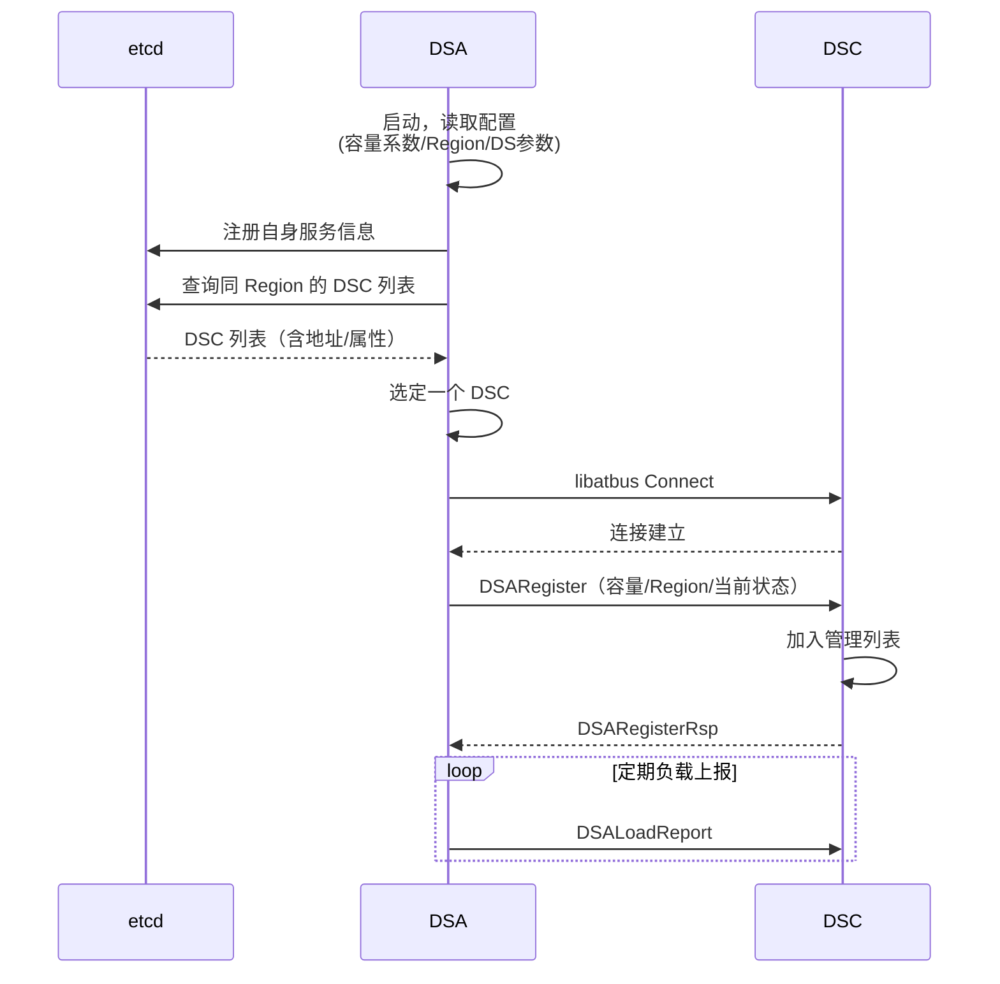
```mermaid
sequenceDiagram
    participant etcd as etcd
    participant DSA as DSA
    participant DSC as DSC

    DSA->>DSA: 启动，读取配置<br/>(容量系数/Region/DS参数)
    DSA->>etcd: 注册自身服务信息
    DSA->>etcd: 查询同 Region 的 DSC 列表
    etcd-->>DSA: DSC 列表（含地址/属性）
    DSA->>DSA: 选定一个 DSC
    DSA->>DSC: libatbus Connect
    DSC-->>DSA: 连接建立
    DSA->>DSC: DSARegister（容量/Region/当前状态）
    DSC->>DSC: 加入管理列表
    DSC-->>DSA: DSARegisterRsp
    
    loop 定期负载上报
        DSA->>DSC: DSALoadReport
    end
```

### 7.2 DS 拉起流程

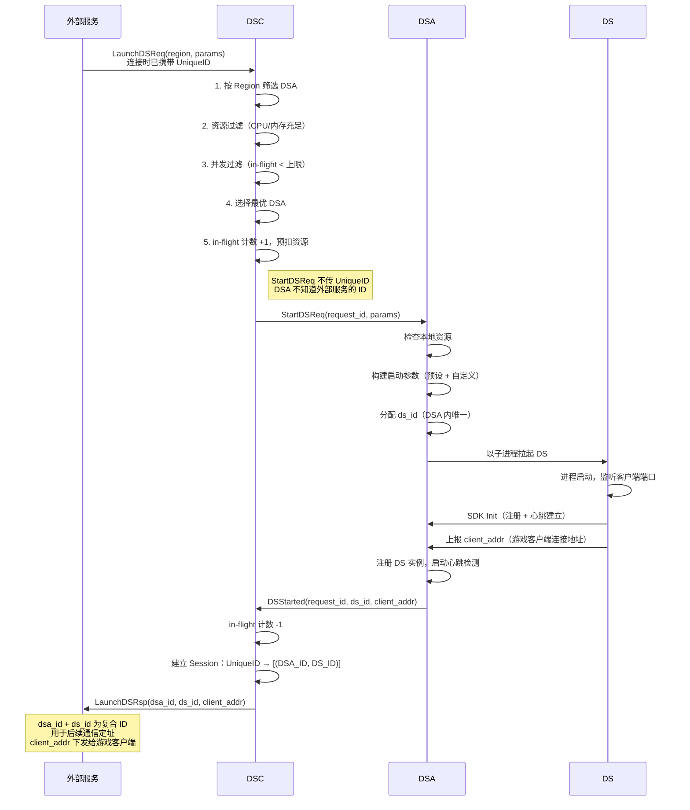
```mermaid
sequenceDiagram
    participant Ext as 外部服务
    participant DSC as DSC
    participant DSA as DSA
    participant DS as DS

    Ext->>DSC: LaunchDSReq(region, params)<br/>连接时已携带 UniqueID
    
    DSC->>DSC: 1. 按 Region 筛选 DSA
    DSC->>DSC: 2. 资源过滤（CPU/内存充足）
    DSC->>DSC: 3. 并发过滤（in-flight < 上限）
    DSC->>DSC: 4. 选择最优 DSA
    DSC->>DSC: 5. in-flight 计数 +1，预扣资源
    
    Note right of DSC: StartDSReq 不传 UniqueID<br/>DSA 不知道外部服务的 ID
    DSC->>DSA: StartDSReq(request_id, params)
    
    DSA->>DSA: 检查本地资源
    DSA->>DSA: 构建启动参数（预设 + 自定义）
    DSA->>DSA: 分配 ds_id（DSA 内唯一）
    DSA->>DS: 以子进程拉起 DS
    DS->>DS: 进程启动，监听客户端端口
    DS->>DSA: SDK Init（注册 + 心跳建立）
    DS->>DSA: 上报 client_addr（游戏客户端连接地址）
    
    DSA->>DSA: 注册 DS 实例，启动心跳检测
    DSA->>DSC: DSStarted(request_id, ds_id, client_addr)
    
    DSC->>DSC: in-flight 计数 -1
    DSC->>DSC: 建立 Session：UniqueID → [(DSA_ID, DS_ID)]
    DSC->>Ext: LaunchDSRsp(dsa_id, ds_id, client_addr)
    
    Note over Ext: dsa_id + ds_id 为复合 ID<br/>用于后续通信定址<br/>client_addr 下发给游戏客户端
```

### 7.3 DS 通信流程（外部服务 ↔ DS）

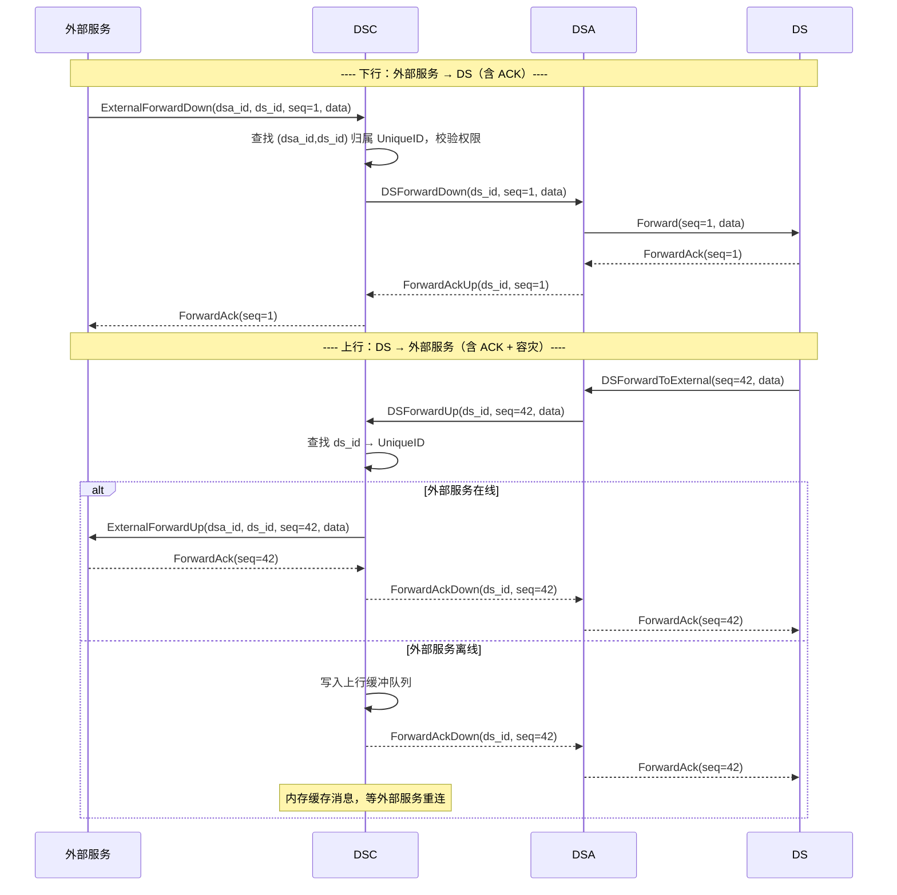
```mermaid
sequenceDiagram
    participant Ext as 外部服务
    participant DSC as DSC
    participant DSA as DSA
    participant DS as DS

    Note over Ext,DS: ---- 下行：外部服务 → DS（含 ACK）----
    Ext->>DSC: ExternalForwardDown(dsa_id, ds_id, seq=1, data)
    DSC->>DSC: 查找 (dsa_id,ds_id) 归属 UniqueID，校验权限
    DSC->>DSA: DSForwardDown(ds_id, seq=1, data)
    DSA->>DS: Forward(seq=1, data)
    DS-->>DSA: ForwardAck(seq=1)
    DSA-->>DSC: ForwardAckUp(ds_id, seq=1)
    DSC-->>Ext: ForwardAck(seq=1)

    Note over Ext,DS: ---- 上行：DS → 外部服务（含 ACK + 容灾）----
    DS->>DSA: DSForwardToExternal(seq=42, data)
    DSA->>DSC: DSForwardUp(ds_id, seq=42, data)
    DSC->>DSC: 查找 ds_id → UniqueID
    alt 外部服务在线
        DSC->>Ext: ExternalForwardUp(dsa_id, ds_id, seq=42, data)
        Ext-->>DSC: ForwardAck(seq=42)
        DSC-->>DSA: ForwardAckDown(ds_id, seq=42)
        DSA-->>DS: ForwardAck(seq=42)
    else 外部服务离线
        DSC->>DSC: 写入上行缓冲队列
        DSC-->>DSA: ForwardAckDown(ds_id, seq=42)
        DSA-->>DS: ForwardAck(seq=42)
        Note over DSC: 内存缓存消息，等外部服务重连
    end
```

### 7.4 DS 正常退出流程

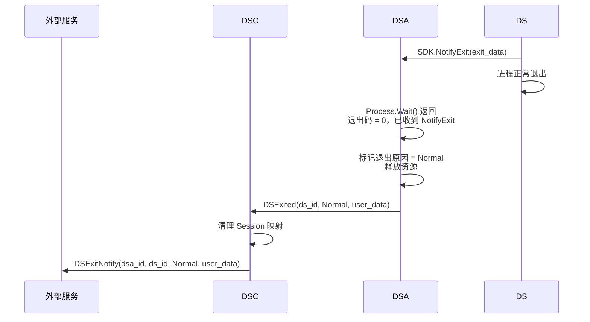
```mermaid
sequenceDiagram
    participant Ext as 外部服务
    participant DSC as DSC
    participant DSA as DSA
    participant DS as DS

    DS->>DSA: SDK.NotifyExit(exit_data)
    DS->>DS: 进程正常退出
    DSA->>DSA: Process.Wait() 返回<br/>退出码 = 0，已收到 NotifyExit
    DSA->>DSA: 标记退出原因 = Normal<br/>释放资源
    DSA->>DSC: DSExited(ds_id, Normal, user_data)
    DSC->>DSC: 清理 Session 映射
    DSC->>Ext: DSExitNotify(dsa_id, ds_id, Normal, user_data)
```

### 7.5 DS Crash 退出流程

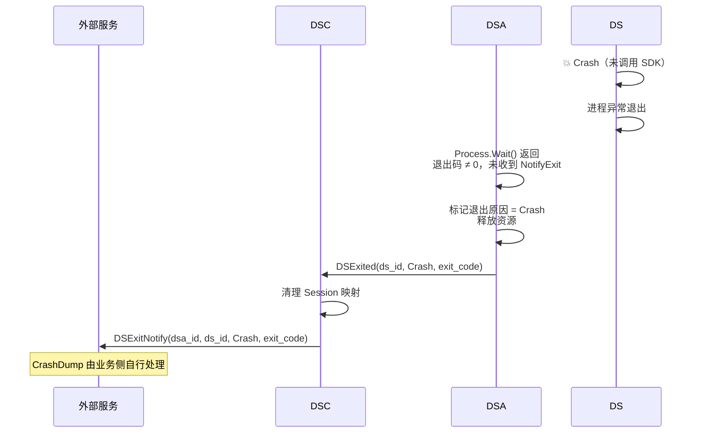
```mermaid
sequenceDiagram
    participant Ext as 外部服务
    participant DSC as DSC
    participant DSA as DSA
    participant DS as DS

    DS->>DS: 💥 Crash（未调用 SDK）
    DS->>DS: 进程异常退出
    DSA->>DSA: Process.Wait() 返回<br/>退出码 ≠ 0，未收到 NotifyExit
    DSA->>DSA: 标记退出原因 = Crash<br/>释放资源
    DSA->>DSC: DSExited(ds_id, Crash, exit_code)
    DSC->>DSC: 清理 Session 映射
    DSC->>Ext: DSExitNotify(dsa_id, ds_id, Crash, exit_code)
    
    Note over Ext: CrashDump 由业务侧自行处理
```

### 7.6 DS 心跳超时流程（死循环）

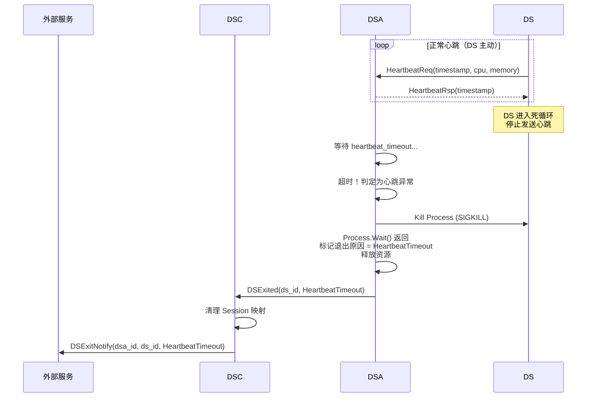
```mermaid
sequenceDiagram
    participant Ext as 外部服务
    participant DSC as DSC
    participant DSA as DSA
    participant DS as DS

    loop 正常心跳（DS 主动）
        DS->>DSA: HeartbeatReq(timestamp, cpu, memory)
        DSA-->>DS: HeartbeatRsp(timestamp)
    end

    Note over DS: DS 进入死循环<br/>停止发送心跳
    DSA->>DSA: 等待 heartbeat_timeout...
    DSA->>DSA: 超时！判定为心跳异常

    DSA->>DS: Kill Process (SIGKILL)
    DSA->>DSA: Process.Wait() 返回<br/>标记退出原因 = HeartbeatTimeout<br/>释放资源
    DSA->>DSC: DSExited(ds_id, HeartbeatTimeout)
    DSC->>DSC: 清理 Session 映射
    DSC->>Ext: DSExitNotify(dsa_id, ds_id, HeartbeatTimeout)
```

### 7.7 外部服务重连流程

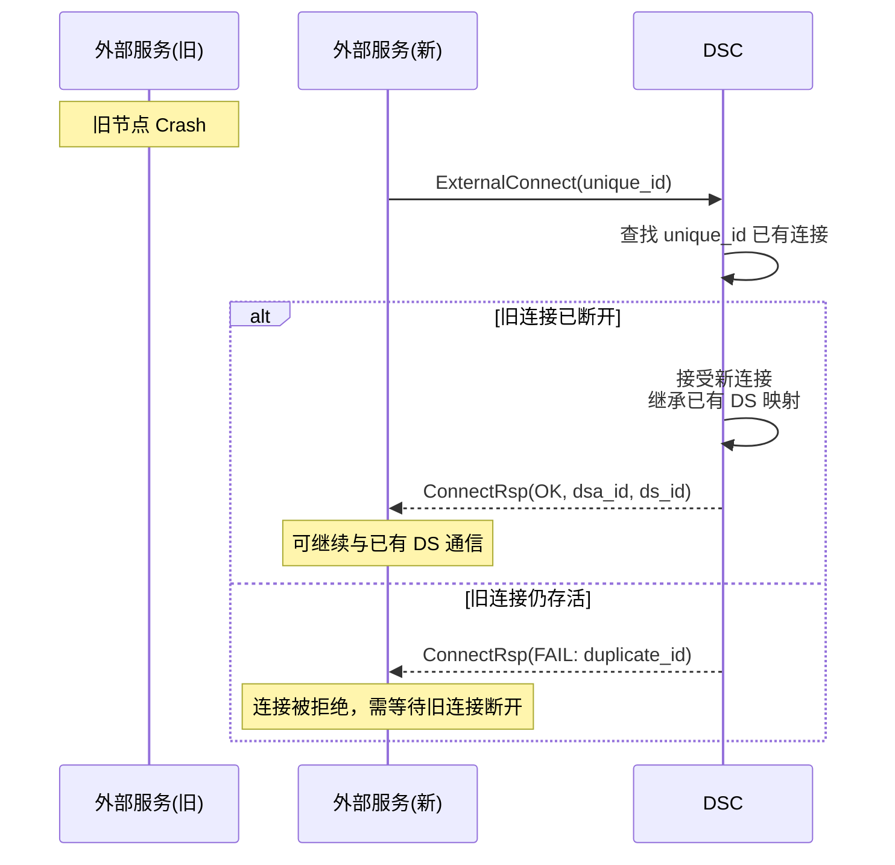
```mermaid
sequenceDiagram
    participant ExtOld as 外部服务(旧)
    participant ExtNew as 外部服务(新)
    participant DSC as DSC

    Note over ExtOld: 旧节点 Crash

    ExtNew->>DSC: ExternalConnect(unique_id)
    
    DSC->>DSC: 查找 unique_id 已有连接

    alt 旧连接已断开
        DSC->>DSC: 接受新连接<br/>继承已有 DS 映射
        DSC-->>ExtNew: ConnectRsp(OK, dsa_id, ds_id)
        Note over ExtNew: 可继续与已有 DS 通信
    else 旧连接仍存活
        DSC-->>ExtNew: ConnectRsp(FAIL: duplicate_id)
        Note over ExtNew: 连接被拒绝，需等待旧连接断开
    end
```

### 7.8 DSA 断线流程

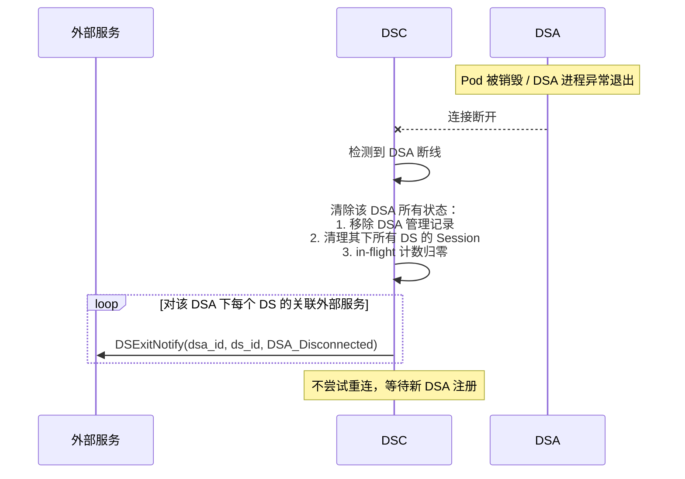
```mermaid
sequenceDiagram
    participant Ext as 外部服务
    participant DSC as DSC
    participant DSA as DSA

    Note over DSA: Pod 被销毁 / DSA 进程异常退出

    DSA--xDSC: 连接断开
    DSC->>DSC: 检测到 DSA 断线
    DSC->>DSC: 清除该 DSA 所有状态：<br/>1. 移除 DSA 管理记录<br/>2. 清理其下所有 DS 的 Session<br/>3. in-flight 计数归零

    loop 对该 DSA 下每个 DS 的关联外部服务
        DSC->>Ext: DSExitNotify(dsa_id, ds_id, DSA_Disconnected)
    end

    Note over DSC: 不尝试重连，等待新 DSA 注册
```

### 7.9 Seed Fork 拉起 DS 流程

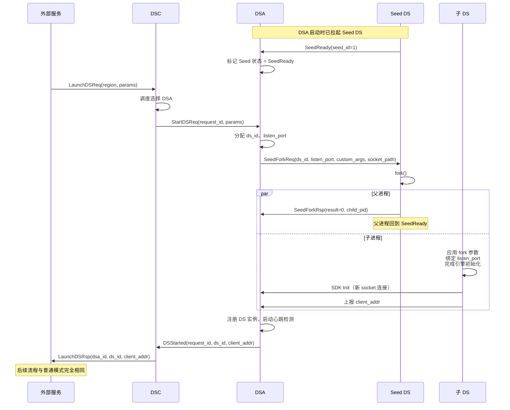
```mermaid
sequenceDiagram
    participant Ext as 外部服务
    participant DSC as DSC
    participant DSA as DSA
    participant Seed as Seed DS
    participant Child as 子 DS

    Note over DSA,Seed: DSA 启动时已拉起 Seed DS
    Seed->>DSA: SeedReady(seed_id=1)
    DSA->>DSA: 标记 Seed 状态 = SeedReady

    Ext->>DSC: LaunchDSReq(region, params)
    DSC->>DSC: 调度选择 DSA
    DSC->>DSA: StartDSReq(request_id, params)

    DSA->>DSA: 分配 ds_id、listen_port
    DSA->>Seed: SeedForkReq(ds_id, listen_port, custom_args, socket_path)
    Seed->>Seed: fork()

    par 父进程
        Seed->>DSA: SeedForkRsp(result=0, child_pid)
        Note over Seed: 父进程回到 SeedReady
    and 子进程
        Child->>Child: 应用 fork 参数<br/>绑定 listen_port<br/>完成引擎初始化
        Child->>DSA: SDK Init（新 socket 连接）
        Child->>DSA: 上报 client_addr
    end

    DSA->>DSA: 注册 DS 实例，启动心跳检测
    DSA->>DSC: DSStarted(request_id, ds_id, client_addr)
    DSC->>Ext: LaunchDSRsp(dsa_id, ds_id, client_addr)

    Note over Ext: 后续流程与普通模式完全相同
```

### 7.10 DS 滚动更新流程

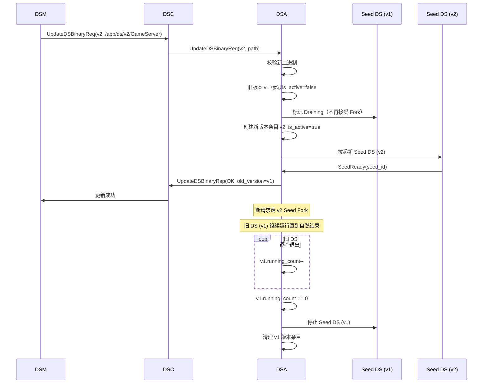
```mermaid
sequenceDiagram
    participant DSM as DSM
    participant DSC as DSC
    participant DSA as DSA
    participant SeedV1 as Seed DS (v1)
    participant SeedV2 as Seed DS (v2)

    DSM->>DSC: UpdateDSBinaryReq(v2, /app/ds/v2/GameServer)
    DSC->>DSA: UpdateDSBinaryReq(v2, path)

    DSA->>DSA: 校验新二进制
    DSA->>DSA: 旧版本 v1 标记 is_active=false
    DSA->>SeedV1: 标记 Draining（不再接受 Fork）

    DSA->>DSA: 创建新版本条目 v2, is_active=true
    DSA->>SeedV2: 拉起新 Seed DS (v2)
    SeedV2->>DSA: SeedReady(seed_id)

    DSA->>DSC: UpdateDSBinaryRsp(OK, old_version=v1)
    DSC->>DSM: 更新成功

    Note over DSA: 新请求走 v2 Seed Fork
    Note over DSA: 旧 DS (v1) 继续运行直到自然结束

    loop 旧 DS 逐个退出
        DSA->>DSA: v1.running_count--
    end

    DSA->>DSA: v1.running_count == 0
    DSA->>SeedV1: 停止 Seed DS (v1)
    DSA->>DSA: 清理 v1 版本条目
```

---

## 8. 状态机

### 8.1 DSA 视角的 DS 状态机

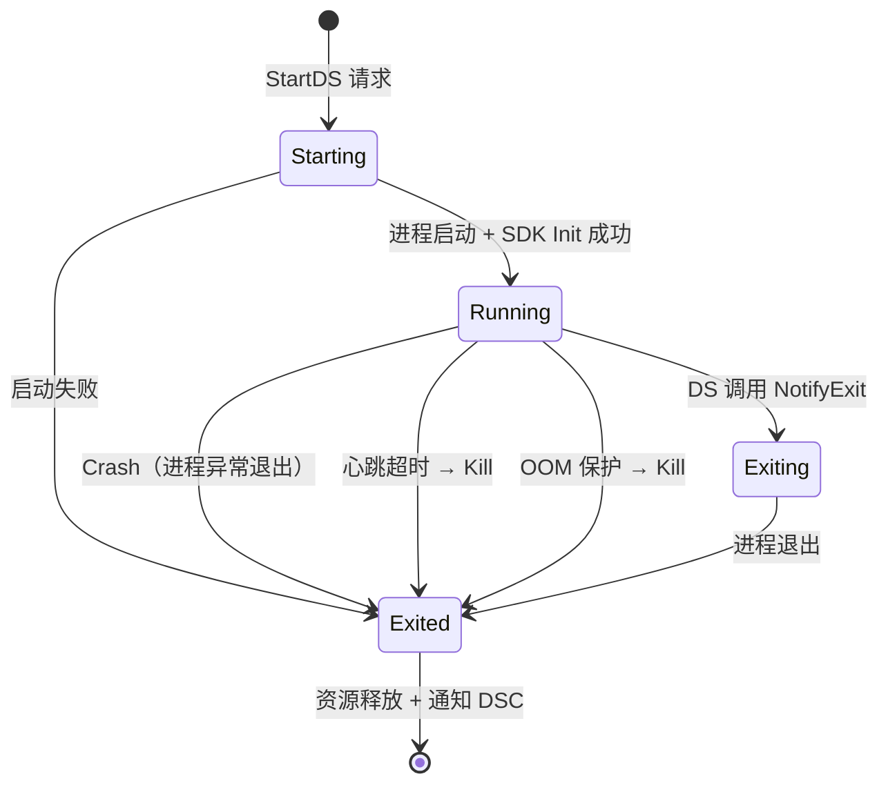
```mermaid
stateDiagram-v2
    [*] --> Starting: StartDS 请求
    Starting --> Running: 进程启动 + SDK Init 成功
    Starting --> Exited: 启动失败

    Running --> Exiting: DS 调用 NotifyExit
    Running --> Exited: Crash（进程异常退出）
    Running --> Exited: 心跳超时 → Kill
    Running --> Exited: OOM 保护 → Kill

    Exiting --> Exited: 进程退出

    Exited --> [*]: 资源释放 + 通知 DSC
```

### 8.2 DSC 视角的会话状态

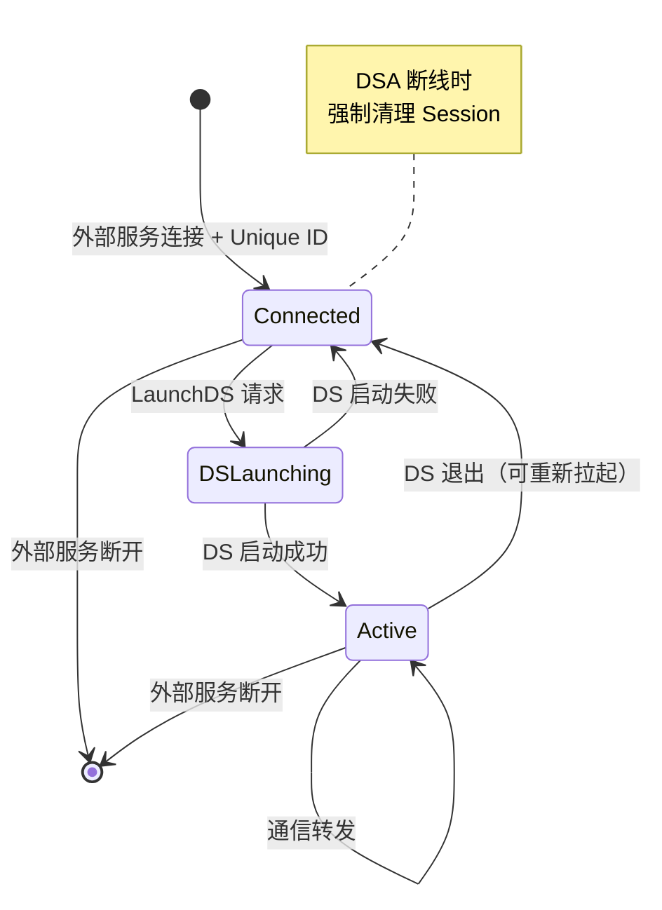
```mermaid
stateDiagram-v2
    [*] --> Connected: 外部服务连接 + Unique ID
    Connected --> DSLaunching: LaunchDS 请求
    DSLaunching --> Active: DS 启动成功
    DSLaunching --> Connected: DS 启动失败

    Active --> Connected: DS 退出（可重新拉起）
    Active --> Active: 通信转发

    Connected --> [*]: 外部服务断开
    Active --> [*]: 外部服务断开

    Note left of Connected: DSA 断线时<br/>强制清理 Session
```

---

## 9. 实现步骤

### Phase 1: 基础框架与协议定义

| 步骤 | 内容 | 产出 |
|------|------|------|
| 1.1 | 定义 Proto 文件 | DSA↔DS、DSA↔DSC、外部服务↔DSC 的所有 protobuf 消息 |
| 1.2 | 生成代码 | `task gen-proto` 生成 C++ 代码 |
| 1.3 | DSA 基础框架 | 基于 libatapp 创建 DSA 服务骨架（C++），配置加载，etcd 注册 |
| 1.4 | DSC 基础框架 | 基于 libatapp 创建 DSC 服务骨架（C++），配置加载，etcd 注册 |
| 1.5 | 连接建立 | DSA 通过服务发现连接 DSC，DSC 管理 DSA 列表 |

### Phase 2: DSA 核心功能

| 步骤 | 内容 | 产出 |
|------|------|------|
| 2.1 | 子进程管理 | `fork+exec` / `posix_spawn` 拉起 DS，`waitpid` 感知退出 |
| 2.2 | DS 本地通信 | DSA↔DS 进程间通信通道（本地 socket / pipe） |
| 2.3 | 心跳检测 | 定期心跳 + 超时判定 + 强杀逻辑 |
| 2.4 | 退出分类 | 区分正常退出 / Crash / 心跳超时 / OOM Kill |
| 2.5 | 容量管理 | CPU/内存账本、有效消耗计算、OOM 保护 |
| 2.6 | 负载上报 | 定期 / 变化时向 DSC 上报负载数据 |

### Phase 3: DSC 核心功能

| 步骤 | 内容 | 产出 |
|------|------|------|
| 3.1 | DSA 管理 | 接收 DSA 注册、维护 DSA 列表和负载状态 |
| 3.2 | 调度算法 | Region 筛选 → 资源过滤 → 并发过滤 → 评分排序 |
| 3.3 | 并发控制 | in-flight 计数器、预扣资源、超时回收 |
| 3.4 | DS 拉起流程 | 接收外部请求 → 调度 → 转发 DSA → 回包 |
| 3.5 | 会话管理 | Unique ID → DS 映射表、访问控制校验 |
| 3.6 | DSA 断线处理 | 检测断线 → 清除状态 → 通知外部服务 |

### Phase 4: 通信转发与外部服务

| 步骤 | 内容 | 产出 |
|------|------|------|
| 4.1 | 消息转发 | 外部服务 ↔ DSC ↔ DSA ↔ DS 全链路消息转发 |
| 4.2 | Unique ID 路由 | SDK 内 DSC 地址存储逻辑，验证同地址始终路由到同一 DSC |
| 4.3 | 重连逻辑 | Unique ID 重复检测、旧连接状态判断、Session 继承 |
| 4.4 | ACK 机制 | 序列号分配、待确认队列、重传逻辑、超时错误 |
| 4.5 | 上行缓冲容灾 | DSC 离线缓冲、重连重放、缓冲大小限制、TTL 过期丢弃 |
| 4.6 | C++ SDK 封装 | 基于 libatapp 封装外部服务 SDK（Connect/Launch/Forward） |
| 4.7 | DS SDK 封装 | 基于 libatapp 封装 DS 侧 SDK（Init/Heartbeat/Exit/Forward） |

### Phase 5: 可观测性与健壮性

| 步骤 | 内容 | 产出 |
|------|------|------|
| 5.1 | DSA 指标接入 | Prometheus metrics 导出（DS 计数/资源使用/退出统计） |
| 5.2 | DSC 指标接入 | Prometheus metrics 导出（DSA 计数/调度统计/转发统计） |
| 5.3 | 日志规范 | 结构化日志（关键操作 + 错误路径） |
| 5.4 | Grafana Dashboard | DSA/DSC 监控面板 |
| 5.5 | 集成测试 | 端到端拉起/通信/退出/断线场景验证 |

### Phase 6: DS SDK (C++) 集成测试

| 步骤 | 内容 | 产出 |
|------|------|------|
| 6.1 | DS Mock 进程 | 用于测试的模拟 DS 进程（支持心跳/退出/通信） |
| 6.2 | 外部服务 Mock | 模拟外部服务调用 SDK 全流程 |
| 6.3 | 异常场景测试 | Crash / 死循环 / OOM / DSA 断线 / Unique ID 重复 |

### Phase 7: Seed 模式

| 步骤 | 内容 | 产出 |
|------|------|------|
| 7.1 | DS SDK Seed 接口 | `EnterSeedLoop()` / `IsSeedMode()` / `SeedForkResult` 实现 |
| 7.2 | DSA Seed 管理 | Seed 生命周期管理（Loading/Ready/Draining/Stopped） |
| 7.3 | SeedFork 协议 | DSA ↔ Seed DS 的 `SeedForkReq/Rsp/Ready` 消息处理 |
| 7.4 | Fork 子进程注册 | 子 DS fork 后重新建立 socket 连接、SDK Init |
| 7.5 | Seed 崩溃恢复 | 自动重拉 Seed、回退普通模式 |
| 7.6 | UE DS 集成验证 | 与 UE Dedicated Server 联调 Seed 模式（PreInit + fork 时机） |

### Phase 8: 滚动更新与 DSM

| 步骤 | 内容 | 产出 |
|------|------|------|
| 8.1 | DSA 版本管理 | 多版本数据结构、active 切换、running_count 跟踪 |
| 8.2 | UpdateDSBinary 协议 | DSC ↔ DSA 更新指令、响应、回滚指令 |
| 8.3 | Seed 代际切换 | 旧 Seed Draining + 新 Seed 拉起 + 平滑过渡 |
| 8.4 | DSM 基础框架 | 基于 libatapp 创建 DSM 服务（C++），连接 DSC、查询 etcd |
| 8.5 | DSM REST API | 全局状态查询、更新触发、回滚、DSA Drain |
| 8.6 | DSM Web UI | Dashboard / Region 详情 / 版本管理 / 告警中心 |

---

## 10. 业界主流方案对比

| 维度 | **本方案 (DSA/DSC)** | **Agones (Google)** | **GameLift (AWS)** | **Thundernetes (Microsoft)** |
|------|---------------------|--------------------|--------------------|------------------------------|
| **架构模型** | DSA sidecar + DSC 调度器，自研组件 | K8s CRD + Controller，GameServer/Fleet 资源 | 全托管 SaaS，Queue + FlexMatch | K8s Operator，GameServer CRD |
| **调度粒度** | 进程级（DSC 选 DSA → DSA 拉起 DS） | Pod 级（Fleet Autoscaler 管理 Pod 数量） | 实例级（Placement Queue 跨 Region） | Pod 级（类似 Agones） |
| **DS 生命周期管理** | DSA 子进程管理，心跳/退出检测 | K8s Pod 生命周期，SDK 状态上报 | Agent 进程管理，Health Check | K8s Pod 生命周期，GSDK 状态上报 |
| **扩缩容** | DSA 随 Pod 扩缩，DSC 手动 | Fleet Autoscaler（Buffer/Webhook） | Auto-scaling Group | 基于 standby 数量自动扩缩 |
| **Region 支持** | 自定义 Region 标签分组 | Multi-cluster Allocation | Multi-Region Queue/Fleet | 单集群 |
| **通信模型** | 外部服务 → DSC → DSA → DS（三跳转发） | 客户端直连 DS Pod（IP:Port） | 客户端直连 DS 实例 | 客户端直连 DS Pod |
| **服务发现** | etcd + libatbus 一致性哈希 | K8s Service + Allocator gRPC | AWS 内部 | K8s Service |
| **外部服务感知** | 仅感知 DSC（DS 完全透明） | 需感知每个 GameServer 地址 | 通过 Placement 获取连接信息 | 需感知 GameServer 地址 |
| **故障恢复** | DSA 断线清除，无状态迁移 | Pod 重建，Fleet 自动补充 | 实例替换，Session 迁移 | Pod 重建 |
| **状态上报** | DS → DSA SDK（心跳+负载） | GSDK Lifecycle hooks | AWS SDK Health Check | GSDK Ready/Allocated |
| **匹配系统** | 不含（由外部服务负责） | 不含（通常搭配 Open Match） | 内置 FlexMatch | 不含 |
| **语言/平台** | C++ (DSA/DSC/DS/外部服务，基于 libatapp) | Go Controller + 任意语言 DS | 任意语言 | Go Operator + 任意语言 |
| **开源** | 内部项目 | ✅ Apache 2.0 | ❌ 商业服务 | ✅ MIT |
| **K8s 依赖** | Pod 内运行但不依赖 CRD | 强依赖 K8s + CRD | 不依赖 K8s | 强依赖 K8s + CRD |

### 方案选型分析

**本方案 (DSA/DSC) 的优势**：
- **外部服务解耦彻底**：外部服务只感知 DSC，不需要维护 DS/Pod 地址列表，大幅降低客户端复杂度
- **与现有架构契合**：基于已有的 libatbus/libatapp 通信层，复用服务发现和一致性哈希能力
- **灵活的进程管理**：DSA 可以精细控制 DS 进程（心跳、OOM 保护、退出分类），比 K8s Pod 级管理更细粒度
- **Region 分组灵活**：不依赖 K8s multi-cluster，在应用层实现 Region 路由

**本方案的局限**：
- **三跳转发延迟**：所有通信经 DSC 转发，不适合高频实时场景（本场景为低频控制，可接受）
- **DSC 单点**：DSC 无状态迁移能力，故障时丢失 Session 映射（可通过多 DSC 分散风险）
- **自研维护成本**：相比 Agones/Thundernetes 等社区方案，需要自行维护全套组件

**适用场景**：
- 外部服务数量多，不希望每个外部服务都感知 DS 拓扑
- DS 通信为低频控制指令（房间管理、状态查询等）
- 已有 libatbus/libatapp 技术栈
- 需要精细控制 DS 进程（OOM 保护、退出分类、子进程密度）
- 需要种子进程（Seed fork）实现毫秒级拉起
- 需要不停机滚动更新 DS 二进制
- 重连后希望自动收到离线期间缓存的消息

---

## 11. Agones 与 DSA/DSC 详细对比

### 11.1 架构层次对比

```
Agones 架构：
  Fleet (K8s CRD)
    └─ GameServer Pod×N────────── 客户端直连
       └ GSDK Sidecar        ↑ IP:Port
          └ GameServer进程  ← 分配器返回地址

DSA/DSC 架构：
  DSM (全局管理) ─── Web UI / REST API
    └─ DSC×M (手动控制)
      └─ DSA Pod×N (K8s自动扩缩)
           └─ Seed DS → fork() → 子 DS×K  ──── 客户端直连
                                             ↑ IP:Port
  外部服务 → DSC → DSA → DS (SDK)下发地址
```

### 11.2 核心差异详解

#### 差异 1：调度粒度

| | Agones | DSA/DSC |
|--|--------|--------|
| **调度单位** | Pod（一个 Pod 一个 DS） | 进程（一个 Pod 多个 DS） |
| **资源账本** | K8s 资源请求（Pod spec） | DSA 内部 CPU/内存账本 |
| **资源隔离** | cgroup 硬隔离 | 软隔离（账本模型） |
| **密度** | 低（每 Pod 一局）| 高（每 Pod 多局）|

#### 差异 2：外部服务感知范围

| | Agones | DSA/DSC |
|--|--------|--------|
| **分配后** | Allocator 返回 GameServer 的 IP:Port，客户端直连 | DSC 返回 (dsa_id, ds_id, client_addr)，外部服务只感知 DSC |
| **管理指令** | 外部服务封装自定义协议直连连 DS | 通过 DSC 中转，外部服务不需要维护 DS 地址列表 |
| **动态感知** | 外部服务需监听 GameServer资源变化 | DSC 主动推送 DSExitNotify，外部服务被动接收 |

#### 差异 3：DS 生命周期感知

| 责任 | Agones | DSA/DSC |
|------|--------|--------|
| 进程拉起 | `kubectl`/Fleet 拉起 Pod | DSA `fork+exec` 拉起子进程，或 Seed `fork()` 毫秒级拉起 |
| **心跳方向** | DS 主动 → GSDK 内部 → Agones Sidecar | DS 主动 → DSA（心跳包含负载） |
| **心跳超时处理** | K8s livenessProbe 重启 Pod | DSA 判断后 Kill DS，注意: 不重启 Pod |
| **OOM 保护** | K8s OOMKill（Kill整个 Pod）| DSA 主动 Kill 内存最大的 DS，保留其他 DS |
| Crash 检测 | K8s Pod 失败重启 | DSA `Process.Wait()` 感知，区分退出原因 |
| 退出分类 | 不区分 | 区分正常/Crash/心跳超时/OOM Kill |

#### 差异 4：扩缩容策略

| | Agones | DSA/DSC |
|--|--------|--------|
| **DS 层** | Fleet Autoscaler（Buffer/Webhook 策略） | DSA 内部按资源账本扩容局数 |
| **Pod 层** | HPA/VPA（通常手动） | DSA Pod 随 K8s 自动水平扩缩 |
| **控制器层** | Agones Controller（自动）| DSC 手动控制数量 |
| **Region 跨居** | Multi-cluster Allocation（复杂） | 应用层 Region 标签，不依赖 K8s multi-cluster |

#### 差异 5：外部服务与 DS 的业务消息通信

| | Agones | DSA/DSC |
|--|--------|--------|
| **模型** | 外部服务自定义连接 DS，不过 Agones | 通过 DSC 转发，外部服务不直连 DS |
| **容灾** | 外部服务自行处理断线重传 | DSC 缓冲上行消息，重连后重放 |
| **延迟** | 不经过中转，延迟最低 | 三跳转发，有额外延迟（但本场景为低频管理指令，可接受） |

### 11.3 选型建议

选择 **Agones** 当：
- 客户端直连 DS，不需要上层中转
- 心跳高频，延迟敏感
- 已经高度依赖 K8s 运维体系
- 每 Pod 只跟d一个 DS（密度要求不高）
- 不需要外部服务与 DS 之间的管理消息容灾

选择 **DSA/DSC** 当：
- 外部服务数量多，希望不维护 DS 地址列表
- DS 通信为低频管理指令，容受三跳转发延迟
- 已有 libatbus/libatapp 技术栈
- 需要精细控制 DS 进程（OOM 保护、退出分类、子进程密度）
- 需要种子进程 Seed fork 实现毫秒级 DS 拉起
- 需要不停机滚动更新 DS 二进制
- 需要全局管理面板（DSM）统一运维
- 重连后希望自动收到离线期间缓存的消息

### DSA 配置示例

```yaml
dsa:
  capacity:
    cpu: 10.0           # Pod CPU 承载上限
    memory: 16384.0     # Pod 内存承载上限 (MB)
    memory_kill_threshold: 15360.0  # OOM 保护阈值 (MB)
  
  regions:
    - "region-cn-east"
    - "region-cn-north"
  
  ds:
    binary_path: "/app/ds/v1/GameServer"
    preset_args:
      - "-log"
      - "-unattended"
      - "-nullrhi"
    heartbeat_interval: "5s"
    heartbeat_timeout: "30s"

  seed:
    enabled: true                # 启用种子模式
    count: 1                     # 种子进程数量
    ready_timeout: "120s"        # 种子启动超时
    seed_args:
      - "--ds-seed"

  report:
    load_report_interval: "10s"  # 负载上报间隔
```

### DSC 配置示例

```yaml
dsc:
  regions:
    - "region-cn-east"
  
  scheduling:
    max_inflight_per_dsa: 3      # 单 DSA 最大 in-flight 拉起数
    inflight_timeout: "60s"       # in-flight 超时
    strategy: "most_available"    # 调度策略: most_available | weighted_score
  
  session:
    duplicate_id_policy: "reject" # 重复 Unique ID 策略: reject（旧连接存活时拒绝）
```

---

## 12. DSM (Dedicated Server Manager) 全局管理

### 12.1 概述

DSM 是 DSA/DSC 体系的**全局管理组件**，为运维人员提供统一的视图和管理能力。DSM 不参与 DS 拉起和通信的数据面，仅走管理面。

### 12.2 架构位置

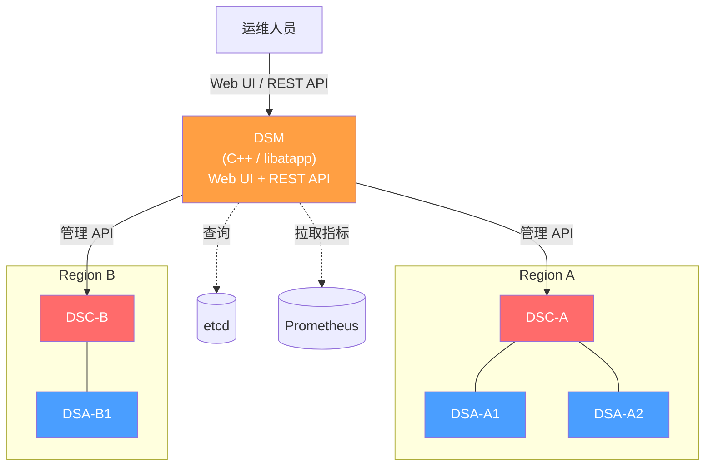
```mermaid
graph TB
    DSM["DSM<br/>(C++ / libatapp)<br/>Web UI + REST API"]

    subgraph "Region A"
        DSC_A["DSC-A"]
        DSA_A1["DSA-A1"]
        DSA_A2["DSA-A2"]
        DSC_A --- DSA_A1
        DSC_A --- DSA_A2
    end

    subgraph "Region B"
        DSC_B["DSC-B"]
        DSA_B1["DSA-B1"]
        DSC_B --- DSA_B1
    end

    DSM -->|"管理 API"| DSC_A
    DSM -->|"管理 API"| DSC_B
    DSM -.->|"查询"| etcd[("etcd")]
    DSM -.->|"拉取指标"| Prometheus[("Prometheus")]

    Operator["运维人员"] -->|"Web UI / REST API"| DSM

    style DSM fill:#ff9f43,color:#fff
    style DSC_A fill:#ff6b6b,color:#fff
    style DSC_B fill:#ff6b6b,color:#fff
    style DSA_A1 fill:#4a9eff,color:#fff
    style DSA_A2 fill:#4a9eff,color:#fff
    style DSA_B1 fill:#4a9eff,color:#fff
```

### 12.3 核心功能

| 模块 | 功能 | 说明 |
|------|------|------|
| **Dashboard** | 全局概览 | 各 Region 的 DSA/DSC/DS 数量、资源使用率、健康状态 |
| **DS 列表** | 实时 DS 查看 | 按 Region/DSA/状态筛选，查看每个 DS 的详细信息 |
| **DSA 管理** | DSA 运维 | 查看 DSA 列表、手动摘除 DSA、触发 DSA Drain（不再分配新 DS，等待存量结束） |
| **版本管理** | DS 滚动更新 | 触发 DS 二进制更新、查看更新进度、一键回滚 |
| **指标聚合** | 监控 | 聚合所有 DSC/DSA 的 Prometheus 指标，提供全局视图 |
| **告警** | 异常通知 | DSA Crash 率异常、DS 心跳超时率突增、资源不足等 |
| **审计日志** | 操作追溯 | 所有管理操作（更新、摘除、Kill）留痕 |

### 12.4 通信方式

| 路径 | 用途 |
|------|------|
| DSM → etcd | 查询所有 DSC/DSA 注册信息，监听变化 |
| DSM → DSC | 查询 DSC 状态、发送管理指令（如触发 DS 更新） |
| DSM → DSA（经 DSC 转发） | 发送更新指令、Drain 指令等 |
| DSM ← Prometheus | 拉取 DSA/DSC 指标用于展示 |

### 12.5 REST API 设计

| 方法 | 路径 | 说明 |
|------|------|------|
| GET | `/api/v1/regions` | 获取所有 Region 及概况 |
| GET | `/api/v1/regions/{region}/dsas` | 获取指定 Region 下所有 DSA 状态 |
| GET | `/api/v1/regions/{region}/ds` | 获取指定 Region 下所有 DS 列表 |
| GET | `/api/v1/dsa/{dsa_id}` | 获取单个 DSA 详情 |
| POST | `/api/v1/dsa/{dsa_id}/drain` | 触发 DSA Drain（不再分配新 DS） |
| POST | `/api/v1/regions/{region}/update` | 触发指定 Region 的 DS 滚动更新 |
| POST | `/api/v1/regions/{region}/rollback` | 触发指定 Region 的 DS 回滚 |
| GET | `/api/v1/versions` | 查看所有 Region 的 DS 版本分布 |

### 12.6 Web UI 页面

| 页面 | 内容 |
|------|------|
| **全局总览** | Region 卡片（DSA/DS 数量、资源使用饼图、健康率） |
| **Region 详情** | 该 Region 下所有 DSA、DSC 列表及状态 |
| **DSA 详情** | 该 DSA 下所有 DS 列表、资源消耗、版本信息、Seed 状态 |
| **DS 详情** | 单个 DS 的生命周期事件、心跳历史、资源曲线 |
| **版本管理** | 当前活跃版本、历史版本、更新/回滚操作面板 |
| **告警中心** | 告警列表、确认/静默操作 |

### 12.7 实现建议

- DSM 同样基于 libatapp 实现（C++），内嵌 HTTP 服务器提供 REST API
- Web 前端可选择轻量方案（如嵌入式 Vue/React SPA，打包为静态资源编译进二进制）
- 首期可仅实现 **CLI 工具 + REST API**，Web UI 作为后续迭代
- DSM 为**无状态服务**，所有持久数据来自 etcd 和 Prometheus
- 可部署多个 DSM 实例做负载分担（无状态，任意一个均可处理请求）
