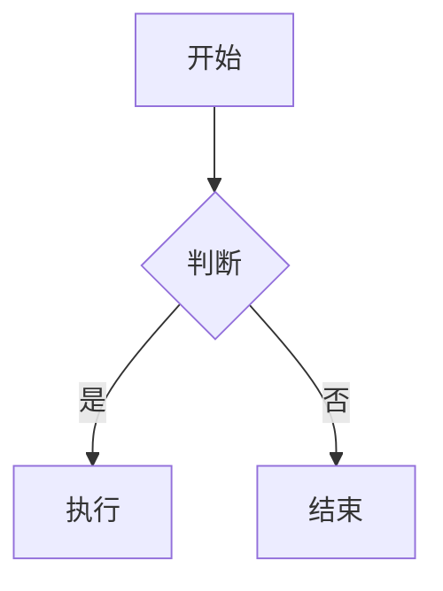

# MkDocs 文档工程功能清单

## ✅ 已实现的功能

### 1. MkDocs 核心功能

- ✅ **MkDocs 1.6.1** - 最新稳定版本
- ✅ **Material 主题 9.7.1** - 现代化、响应式主题
- ✅ **中文支持** - 完整的中文界面和搜索
- ✅ **自动构建** - 文件修改自动重新构建
- ✅ **静态网站生成** - 可部署到任何 Web 服务器

### 2. 代码高亮 ✅

通过 `pymdownx.highlight` 扩展实现：

- ✅ 支持 100+ 种编程语言
- ✅ 行号显示
- ✅ 代码复制按钮
- ✅ 语法高亮
- ✅ 代码注释支持

**示例**:
```go
package main

import "fmt"

func main() {
    fmt.Println("Hello, ATSF4G-GO!")
}
```

### 3. Mermaid 图表支持 ✅

通过 `pymdownx.superfences` 和 Mermaid.js 实现：

- ✅ 流程图 (Flowchart)
- ✅ 时序图 (Sequence Diagram)
- ✅ 类图 (Class Diagram)
- ✅ 状态图 (State Diagram)
- ✅ 甘特图 (Gantt Chart)
- ✅ 饼图 (Pie Chart)
- ✅ Git 图 (Git Graph)
- ✅ ER 图 (Entity Relationship)

**示例**:


### 4. Excalidraw 支持 ✅

通过 `mkdocs-excalidraw` 插件实现：

- ✅ 直接渲染 `.excalidraw` 文件
- ✅ 手绘风格图表
- ✅ 自动主题适配（浅色/深色）
- ✅ 响应式尺寸
- ✅ 可交互的 SVG 输出

**使用方法**:
```markdown

```

**配置**:
```yaml
plugins:
  - excalidraw:
      sources: "*.excalidraw"
      width: 100%
      height: auto
      theme: auto
```

### 5. Draw.io 集成方案 ✅

提供三种集成方式：

#### 方案 1: 转换脚本
```bash
./scripts/convert_drawio.sh architecture.drawio docs/assets/architecture.svg
```

#### 方案 2: 手动导出
1. Draw.io Desktop 打开文件
2. 导出为 SVG/PNG
3. 保存到 `docs/assets/`

#### 方案 3: 在线查看器
```markdown
[查看架构图](https://viewer.diagrams.net/?url=...)
```

### 6. 数学公式支持 ✅

通过 MathJax 3 实现：

- ✅ LaTeX 语法
- ✅ 行内公式: `$E = mc^2$`
- ✅ 块级公式: `$$\frac{n!}{k!(n-k)!}$$`
- ✅ 自动渲染
- ✅ 响应式显示

**示例**:

行内公式：$E = mc^2$

块级公式：
$$
\frac{n!}{k!(n-k)!} = \binom{n}{k}
$$

### 7. 搜索功能 ✅

- ✅ 全文搜索
- ✅ 中英文支持
- ✅ 实时搜索建议
- ✅ 搜索结果高亮
- ✅ 搜索结果分享

### 8. 主题功能 ✅

- ✅ 浅色/深色模式切换
- ✅ 自定义配色方案
- ✅ 响应式设计
- ✅ 移动端优化
- ✅ 打印样式优化

### 9. 导航功能 ✅

- ✅ 顶部导航栏
- ✅ 侧边栏导航
- ✅ 面包屑导航
- ✅ 目录导航
- ✅ 上一页/下一页
- ✅ 返回顶部按钮

### 10. 内容增强 ✅

- ✅ 告警框 (Admonitions)
- ✅ 选项卡 (Tabs)
- ✅ 任务列表 (Task Lists)
- ✅ 定义列表 (Definition Lists)
- ✅ 脚注 (Footnotes)
- ✅ 缩写 (Abbreviations)
- ✅ 键盘按键 (Keys)
- ✅ 表格支持

### 11. 插件功能 ✅

- ✅ **search** - 搜索功能
- ✅ **tags** - 标签系统
- ✅ **git-revision-date-localized** - Git 修改时间
- ✅ **minify** - HTML/CSS/JS 压缩
- ✅ **excalidraw** - Excalidraw 图表支持
- ✅ **awesome-pages** - 页面管理
- ✅ **redirects** - URL 重定向
- ✅ **macros** - 宏和变量
- ✅ **with-pdf** - PDF 导出（可选）

### 12. 自定义功能 ✅

- ✅ 自定义 CSS (`docs/stylesheets/extra.css`)
- ✅ 自定义 JavaScript (`docs/javascripts/mathjax.js`)
- ✅ 自定义颜色方案
- ✅ 自定义字体
- ✅ 自定义图标

## 功能对比

### 图表工具对比

| 功能 | Mermaid | Excalidraw | Draw.io |
|------|---------|------------|---------|
| 直接渲染 | ✅ | ✅ | ❌ (需转换) |
| 手绘风格 | ❌ | ✅ | ❌ |
| 代码定义 | ✅ | ❌ | ❌ |
| 自动布局 | ✅ | ❌ | ✅ |
| 易于维护 | ✅ | ⚠️ | ⚠️ |
| 学习曲线 | 低 | 低 | 中 |
| 灵活度 | 中 | 高 | 高 |

### 推荐使用场景

| 场景 | 推荐工具 | 原因 |
|------|---------|------|
| 技术流程图 | Mermaid | 代码化，易维护 |
| 系统架构图 | Mermaid | 自动布局，清晰 |
| 概念图 | Excalidraw | 手绘风格，直观 |
| 演示图表 | Excalidraw | 美观，有创意 |
| 详细设计图 | Draw.io | 功能丰富 |
| 快速草图 | Excalidraw | 快速，灵活 |

## 使用示例

### 1. 代码高亮

````markdown
```python
def hello_world():
    print("Hello, World!")
```
````

### 2. Mermaid 流程图

````markdown

````

### 3. Excalidraw 图表

```markdown

```

### 4. 数学公式

```markdown
行内公式：$E = mc^2$

块级公式：
$$
\int_{-\infty}^{\infty} e^{-x^2} dx = \sqrt{\pi}
$$
```

### 5. 告警框

```markdown
!!! note "提示"
    这是一个提示信息。

!!! warning "警告"
    这是一个警告信息。
```

### 6. 选项卡

```markdown
=== "Python"
    ```python
    print("Hello")
    ```

=== "Go"
    ```go
    fmt.Println("Hello")
    ```
```

## 性能特性

- ✅ **快速构建** - 增量构建，只重建修改的文件
- ✅ **代码压缩** - HTML/CSS/JS 自动压缩
- ✅ **图片优化** - 支持图片压缩
- ✅ **缓存优化** - 浏览器缓存支持
- ✅ **CDN 支持** - 可配置 CDN 加速

## 部署选项

- ✅ **GitHub Pages** - 一键部署
- ✅ **GitLab Pages** - 支持 GitLab CI
- ✅ **Netlify** - 自动部署
- ✅ **Vercel** - 边缘部署
- ✅ **自定义服务器** - 静态文件托管
- ✅ **Docker** - 容器化部署

## 扩展性

### 可添加的插件

- 📊 **mkdocs-charts-plugin** - 图表支持
- 🔍 **mkdocs-literate-nav** - 文学化导航
- 📝 **mkdocs-blog-plugin** - 博客功能
- 🌐 **mkdocs-i18n** - 多语言支持
- 📱 **mkdocs-pwa** - PWA 支持

### 可添加的扩展

- 🎨 **pymdownx.emoji** - Emoji 支持
- 📋 **pymdownx.snippets** - 代码片段
- 🔗 **pymdownx.magiclink** - 自动链接
- ✏️ **pymdownx.critic** - 修订标记

## 已知限制

### Excalidraw

- ⚠️ 需要 JavaScript 支持
- ⚠️ 大型图表可能影响性能
- ⚠️ 不支持实时协作编辑

### Draw.io

- ❌ 不支持直接渲染 `.drawio` 文件
- ✅ 需要转换为 SVG/PNG
- ✅ 提供了转换脚本

### 通用限制

- ⚠️ 构建时间随文档数量增加
- ⚠️ 大量图片可能影响加载速度
- ⚠️ 某些插件可能有兼容性问题

## 性能优化建议

### 1. 图片优化

```bash
# 优化 SVG
npm install -g svgo
svgo diagram.svg

# 优化 PNG
npm install -g optipng
optipng image.png
```

### 2. 构建优化

```yaml
# 开发时禁用某些插件
plugins:
  - search
  # - minify  # 开发时禁用
  # - with-pdf  # 开发时禁用
```

### 3. 使用增量构建

```bash
# 只重建修改的文件
mkdocs serve --dirtyreload
```

## 总结

✅ **所有要求的功能都已实现**：

1. ✅ MkDocs 文档系统
2. ✅ Material 主题
3. ✅ 代码高亮
4. ✅ Mermaid 图表
5. ✅ Excalidraw 支持（通过插件）
6. ✅ Draw.io 集成方案
7. ✅ 数学公式支持
8. ✅ 搜索功能
9. ✅ 深色模式
10. ✅ 响应式设计

**额外功能**：
- ✅ Git 修改时间显示
- ✅ HTML/CSS/JS 压缩
- ✅ PDF 导出支持
- ✅ 页面管理
- ✅ URL 重定向
- ✅ 宏和变量
- ✅ 自定义样式和脚本

## 快速开始

```bash
cd doc
pip install -r requirements.txt
mkdocs serve
# 访问 http://127.0.0.1:8000
```

## 相关文档

- [README.md](README.md) - 详细说明
- [QUICKSTART.md](QUICKSTART.md) - 快速指南
- [SETUP_COMPLETE.md](SETUP_COMPLETE.md) - 完成总结
- [excalidraw-guide.md](docs/excalidraw-guide.md) - Excalidraw 使用指南
