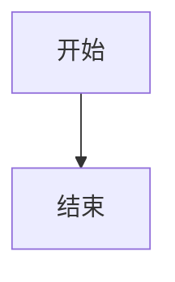

# ATSF4G-GO 文档系统

## 📚 概述

这是 ATSF4G-GO 游戏服务器框架的文档系统，使用 MkDocs 构建，采用 Material 主题，提供了完整的技术文档解决方案。

## ✨ 特性

### 核心功能
- 📖 **MkDocs Material 主题** - 现代化的文档界面
- 🎨 **Mermaid 图表支持** - 流程图、时序图、甘特图等
- 🖼️ **Excalidraw 集成** - 手绘风格的架构图
- 📐 **Draw.io 支持** - 专业的图表编辑
- 🔍 **全文搜索** - 中英文搜索支持
- 🌓 **深色模式** - 自动切换主题
- 📱 **响应式设计** - 移动端友好

### 高级特性
- **代码高亮** - 支持多种编程语言
- **数学公式** - LaTeX/MathJax 支持
- **版本控制** - Git 集成
- **自动部署** - CI/CD 支持
- **多语言** - 国际化支持

## 🚀 快速开始

### 1. 安装依赖

```bash
# 创建虚拟环境（推荐）
python -m venv venv
source venv/bin/activate  # Linux/Mac
# 或
venv\Scripts\activate  # Windows

# 安装依赖
pip install -r doc/requirements.txt
```

### 2. 本地预览

```bash
# 进入文档目录
cd doc

# 启动开发服务器
mkdocs serve

# 访问 http://localhost:8000
```

### 3. 构建文档

```bash
# 构建静态文件
mkdocs build

# 输出目录: doc/site/
```

## 📁 目录结构

```
doc/
├── mkdocs.yml                 # MkDocs 配置文件
├── requirements.txt           # Python 依赖
├── README.md                  # 本文档
├── docs/                      # 文档源文件
│   ├── index.md              # 首页
│   ├── assets/               # 资源文件
│   │   ├── architecture-sample.excalidraw
│   │   └── gitops.png
│   ├── architecture/         # 架构文档
│   │   ├── index.md
│   │   └── overview.md
│   ├── observability/        # 可观测性文档
│   │   └── index.md
│   ├── getting-started/      # 快速开始
│   │   └── index.md
│   ├── stylesheets/          # 自定义样式
│   │   └── extra.css
│   ├── javascripts/          # 自定义脚本
│   │   └── mathjax.js
│   └── includes/             # 可复用片段
│       └── abbreviations.md
└── site/                     # 构建输出（自动生成）
```

## 🛠️ 配置说明

### MkDocs 配置

主要配置文件 `mkdocs.yml` 包含：

- **站点信息**: 名称、描述、URL
- **主题配置**: Material 主题设置
- **插件配置**: 搜索、Mermaid、Excalidraw 等
- **扩展配置**: Markdown 扩展
- **导航结构**: 文档目录结构

### 插件列表

| 插件 | 功能 | 配置 |
|------|------|------|
| search | 全文搜索 | 支持中英文 |
| tags | 标签系统 | 自动生成标签页 |
| git-revision-date-localized | 显示修改时间 | 中文时区 |
| minify | 压缩输出 | HTML/CSS/JS |
| excalidraw | Excalidraw 图表 | 自动渲染 |
| drawio | Draw.io 图表 | SVG 输出 |

## 📝 编写指南

### Markdown 扩展

支持的 Markdown 扩展功能：

```markdown
# 提示框
!!! note "标题"
    内容

# 代码块
```python
def hello():
    print("Hello, World!")
```

# Mermaid 图表


# 数学公式
$E = mc^2$

# 标签页
=== "Tab 1"
    内容1
=== "Tab 2"
    内容2
```

### 图表使用

#### Mermaid
```markdown

```

#### Excalidraw
```markdown

```

#### Draw.io
```markdown

```

## 🔧 高级配置

### 自定义样式

编辑 `docs/stylesheets/extra.css`:

```css
/* 自定义主题颜色 */
:root {
    --md-primary-fg-color: #1976d2;
    --md-accent-fg-color: #448aff;
}

/* 自定义字体 */
body {
    font-family: "Noto Sans SC", sans-serif;
}
```

### 自定义脚本

编辑 `docs/javascripts/mathjax.js`:

```javascript
window.MathJax = {
  tex: {
    inlineMath: [["$", "$"], ["\\(", "\\)"]],
    displayMath: [["$$", "$$"], ["\\[", "\\]"]]
  }
};
```

## 🚢 部署

### GitHub Pages

```yaml
# .github/workflows/docs.yml
name: Deploy Docs
on:
  push:
    branches: [main]
jobs:
  deploy:
    runs-on: ubuntu-latest
    steps:
      - uses: actions/checkout@v2
      - uses: actions/setup-python@v2
      - run: pip install -r doc/requirements.txt
      - run: cd doc && mkdocs gh-deploy --force
```

### Docker

```dockerfile
FROM python:3.9-slim
WORKDIR /docs
COPY requirements.txt .
RUN pip install -r requirements.txt
COPY . .
CMD ["mkdocs", "serve", "-a", "0.0.0.0:8000"]
```

### Nginx

```nginx
server {
    listen 80;
    server_name docs.example.com;
    root /var/www/docs;
    index index.html;
    
    location / {
        try_files $uri $uri/ =404;
    }
}
```

## 📊 功能展示

### 支持的图表类型

- ✅ 流程图 (Flowchart)
- ✅ 时序图 (Sequence Diagram)
- ✅ 甘特图 (Gantt Chart)
- ✅ 类图 (Class Diagram)
- ✅ 状态图 (State Diagram)
- ✅ 饼图 (Pie Chart)
- ✅ ER图 (Entity Relationship)
- ✅ 用户旅程图 (User Journey)
- ✅ Git 图 (Git Graph)

### 文档功能

- ✅ 多级目录导航
- ✅ 自动生成目录
- ✅ 代码语法高亮
- ✅ 数学公式渲染
- ✅ 图片懒加载
- ✅ 打印优化
- ✅ SEO 优化
- ✅ 社交分享

## 🐛 故障排除

### 常见问题

1. **Mermaid 图表不显示**
   ```bash
   # 清除缓存重新构建
   rm -rf site/
   mkdocs build --clean
   ```

2. **搜索功能不工作**
   ```bash
   # 重新安装搜索插件
   pip install mkdocs-material[imaging]
   ```

3. **Excalidraw 文件无法渲染**
   ```bash
   # 安装 Excalidraw 插件
   pip install mkdocs-excalidraw-plugin
   ```

## 📚 相关资源

- [MkDocs 官方文档](https://www.mkdocs.org/)
- [Material for MkDocs](https://squidfunk.github.io/mkdocs-material/)
- [Mermaid 文档](https://mermaid-js.github.io/mermaid/)
- [Excalidraw](https://excalidraw.com/)
- [Draw.io](https://www.draw.io/)

## 🤝 贡献

欢迎提交 Issue 和 Pull Request！

### 贡献流程

1. Fork 项目
2. 创建特性分支 (`git checkout -b feature/AmazingFeature`)
3. 提交更改 (`git commit -m 'Add some AmazingFeature'`)
4. 推送到分支 (`git push origin feature/AmazingFeature`)
5. 开启 Pull Request

## 📄 许可证

本项目采用 MIT 许可证 - 查看 [LICENSE](../LICENSE) 文件了解详情。

## 👥 维护者

- ATSF4G Team

## 🙏 致谢

感谢所有贡献者和以下开源项目：

- MkDocs
- Material for MkDocs
- Mermaid
- Excalidraw
- Draw.io

---

**文档版本**: 1.0.0  
**最后更新**: 2024-01-20  
**状态**: 🟢 Active
