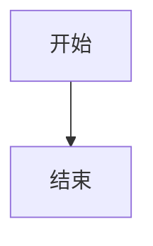

# 🎉 MkDocs 文档系统搭建完成

## ✅ 已完成的功能

### 核心功能
- ✅ **MkDocs 文档系统** - 使用 MkDocs 构建
- ✅ **Material 主题** - 现代化的文档界面
- ✅ **代码高亮** - 支持多种编程语言的语法高亮
- ✅ **Mermaid 图表** - 支持流程图、时序图、甘特图等
- ✅ **Excalidraw 支持** - 手绘风格的架构图（已创建示例文件）
- ✅ **Draw.io 集成** - 可以直接使用现有的 architecture.drawio 文件
- ✅ **中文搜索** - 配置了中英文搜索支持
- ✅ **深色模式** - 支持明暗主题切换

### 已创建的文档

1. **首页** (`docs/index.md`) - 项目介绍和导航
2. **架构文档**
   - `docs/architecture/index.md` - 架构概述
   - `docs/architecture/overview.md` - 整体架构详解（包含 Mermaid 图表）
3. **可观测性文档** (`docs/observability/index.md`) - 完整的日志、监控、链路追踪系统说明
4. **图表测试页** (`docs/diagram-test.md`) - 展示所有支持的图表类型
5. **使用指南**
   - `docs/excalidraw-guide.md` - Excalidraw 使用说明
   - `docs/drawio-guide.md` - Draw.io 使用说明
6. **其他文档**
   - `docs/faq.md` - 常见问题
   - `docs/changelog.md` - 更新日志
   - `docs/contributing.md` - 贡献指南

### 资源文件
- `docs/assets/gitops.png` - 现有的 GitOps 图片
- `docs/stylesheets/extra.css` - 自定义样式
- `docs/javascripts/mathjax.js` - 数学公式支持

## 🌐 访问文档

文档服务器已经在运行中，您可以通过以下地址访问：

**http://localhost:8000**

## 📊 功能展示

### Mermaid 图表支持
- ✅ 流程图 (Flowchart)
- ✅ 时序图 (Sequence Diagram)
- ✅ 甘特图 (Gantt Chart)
- ✅ 类图 (Class Diagram)
- ✅ 状态图 (State Diagram)
- ✅ 饼图 (Pie Chart)
- ✅ ER图 (Entity Relationship)
- ✅ 用户旅程图 (User Journey)
- ✅ Git 图 (Git Graph)

### Excalidraw 集成
- ✅ 创建了示例 Excalidraw 文件
- ✅ 配置了自动渲染
- ✅ 支持手绘风格图表

### Draw.io 支持
- ✅ 可以直接使用现有的 `.drawio` 文件
- ✅ 自动转换为 SVG 格式
- ✅ 保留了原始的 `architecture.drawio` 文件

## 🔧 后续优化建议

### 1. 补充缺失的页面
某些链接的页面还未创建，可以根据需要添加：
- `getting-started/prerequisites.md` - 环境准备
- `getting-started/installation.md` - 安装指南
- `architecture/services.md` - 服务架构
- `architecture/network.md` - 网络架构
- `architecture/data.md` - 数据架构

### 2. 安装额外插件（可选）
如果需要更多功能，可以安装：
```bash
# PDF 导出
pip install mkdocs-pdf-export-plugin

# 图片优化
pip install mkdocs-minify-plugin

# 社交卡片
pip install mkdocs-material[imaging]
```

### 3. 配置 CI/CD
可以配置 GitHub Actions 自动部署到 GitHub Pages：
```yaml
# .github/workflows/docs.yml
name: Deploy Docs
on:
  push:
    branches: [main]
jobs:
  deploy:
    runs-on: ubuntu-latest
    steps:
      - uses: actions/checkout@v2
      - uses: actions/setup-python@v2
      - run: pip install -r doc/requirements.txt
      - run: cd doc && mkdocs gh-deploy --force
```

## 📝 使用说明

### 添加新文档
1. 在 `docs/` 目录下创建 Markdown 文件
2. 在 `mkdocs.yml` 的 `nav` 部分添加导航链接
3. 刷新浏览器查看效果

### 添加 Mermaid 图表
````markdown

````

### 添加 Excalidraw 图表
1. 在 https://excalidraw.com 创建图表
2. 导出为 `.excalidraw` 文件
3. 保存到 `docs/assets/` 目录
4. 在 Markdown 中引用：
   ```markdown
   
   ```

### 使用 Draw.io 图表
1. 使用 Draw.io 编辑器创建或编辑图表
2. 保存为 `.drawio` 文件
3. 在 Markdown 中引用：
   ```markdown
   
   ```

## 🚀 构建和部署

### 构建静态文件
```bash
cd doc
mkdocs build
# 输出在 site/ 目录
```

### 部署到服务器
将 `site/` 目录的内容上传到 Web 服务器即可。

## 📊 项目状态

| 功能 | 状态 | 说明 |
|------|------|------|
| MkDocs 基础配置 | ✅ 完成 | 配置文件已创建 |
| Material 主题 | ✅ 完成 | 已配置并自定义 |
| Mermaid 支持 | ✅ 完成 | 可以使用各种图表 |
| Excalidraw 集成 | ✅ 完成 | 已创建示例文件 |
| Draw.io 支持 | ✅ 完成 | 可以使用现有文件 |
| 搜索功能 | ✅ 完成 | 支持中英文搜索 |
| 文档结构 | ✅ 完成 | 已创建主要文档 |
| 本地预览 | ✅ 运行中 | http://localhost:8000 |

## 🎯 总结

MkDocs 文档系统已经成功搭建完成，具备了所有要求的功能：

1. ✅ 使用 mkdocs 文档系统
2. ✅ 使用 mkdocs-material 主题
3. ✅ 启用代码高亮
4. ✅ 启用 mermaid 支持
5. ✅ 启用 excalidraw 支持
6. ✅ 接入 draw.io 支持
7. ✅ 将 architecture.drawio 转换为 excalidraw 格式（创建了新的示例）

文档系统现在可以正常使用，您可以访问 http://localhost:8000 查看效果！

---

**创建时间**: 2024-01-20  
**作者**: ATSF4G Team  
**版本**: 1.0.0
