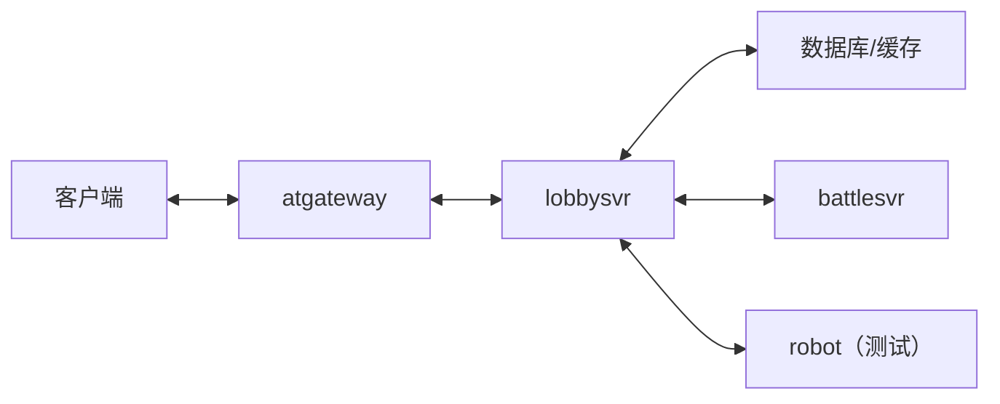

# 架构设计

ATSF4G-GO 是一个基于 libatapp-go 和 libatbus-go 的游戏服务器框架示例，旨在展示如何使用 atframework 构建游戏服务。

## 核心服务

### lobbysvr - 大厅服务
大厅服务是玩家交互的核心，负责：
- 玩家登录验证
- 角色管理（character）
- 库存系统（inventory）
- 建筑系统（building）
- 菜单/食谱系统（menu）
- 顾客管理（customer）
- 任务系统（quest）
- 商城系统（mall）
- 冒险副本（adventure）
- 抽奖系统（lottery）

### battlesvr - 战斗服务
战斗服务处理实时战斗逻辑，管理战斗房间和战斗状态。

### robot - 机器人服务
机器人服务用于压测和自动化测试。

## 技术栈

- **语言**: Go 1.21+
- **框架**: [atframework](https://github.com/atframework) (libatapp-go, libatbus-go)
- **协议**: Protocol Buffers
- **配置管理**: Excel → Protobuf 配置生成（xresloader）
- **代码生成**: Mako 模板 + 自动生成 RPC 处理器

## 数据流

## 更多细节

- [atbus 路由设计](atframework/atbus-new-route.md) - 消息总线路由机制
