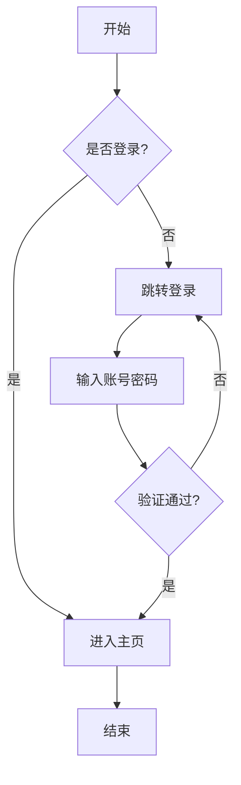
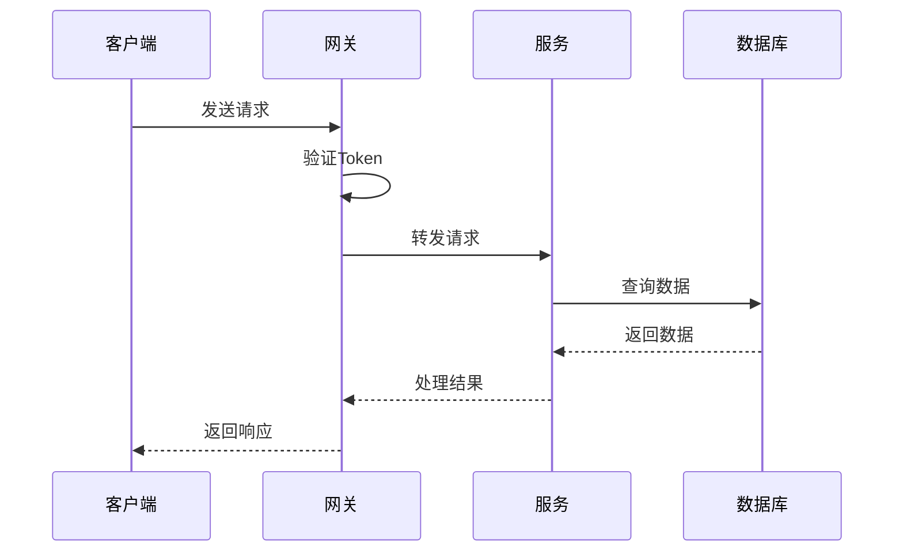
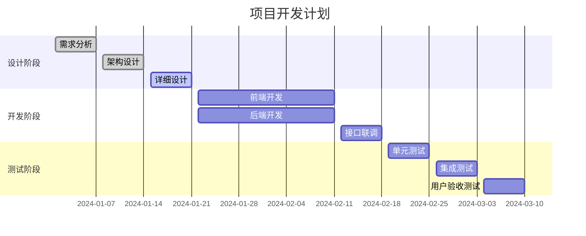
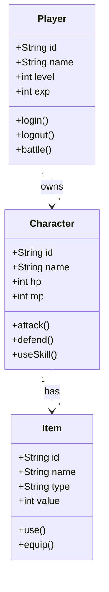
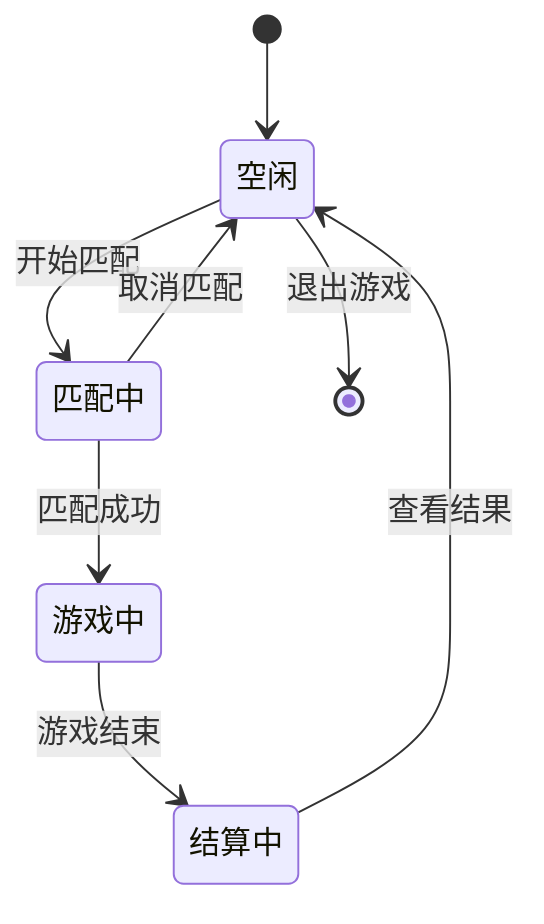
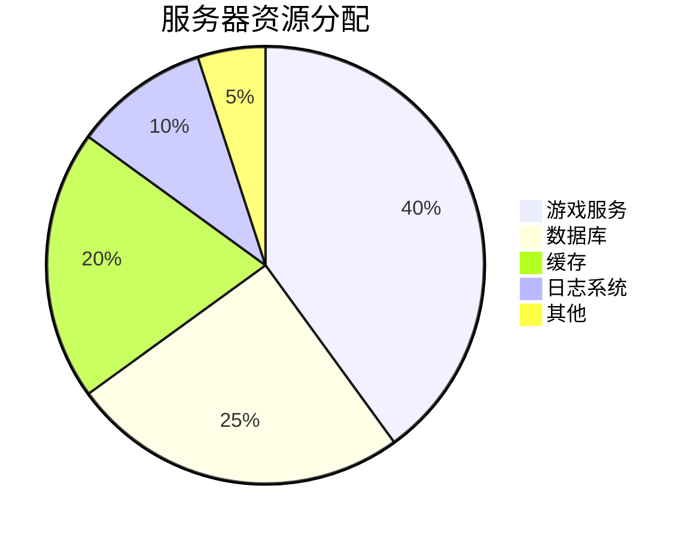
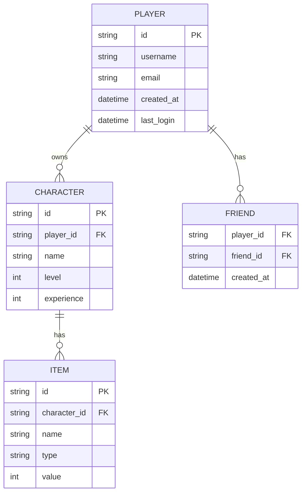
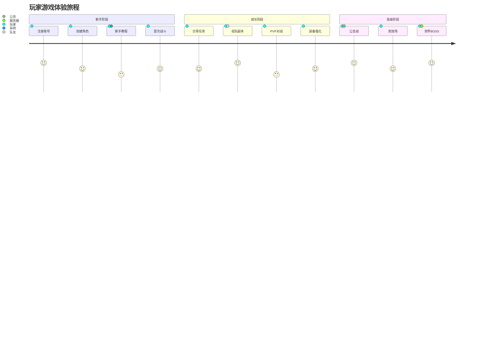
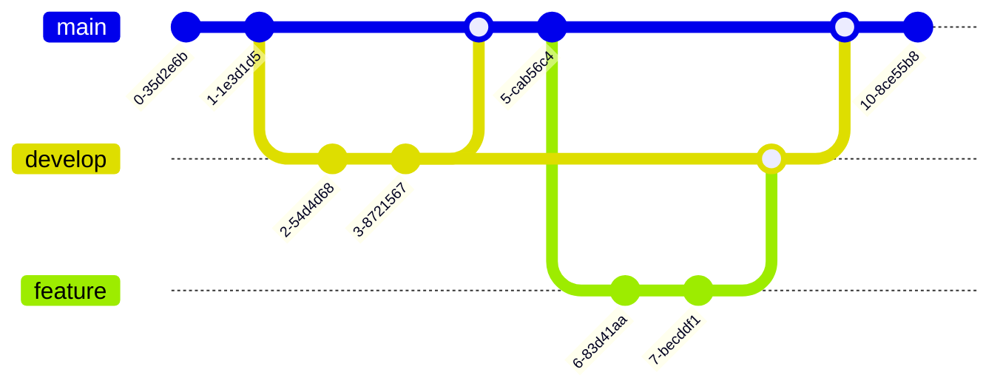

# 文档编写指南

本页汇总了在本仓库使用 MkDocs 编写文档的规则与示例，并整合了 Mermaid、Excalidraw、Draw.io 的使用说明。直接复制示例即可快速上手。

## 基础约定

- 文档目录：源文件位于 `doc/docs/`，静态资源放入 `doc/docs/assets/`，保持小写命名与连字符。
- 预览与构建：在 `doc/` 目录执行 `mkdocs serve` 本地预览，`mkdocs build` 产出静态站点。
- 结构与语气：用短段落和列表表达；标题层级从 `#` 开始依次递进；示例与说明配对出现，方便复制。
- 链接与图片：使用相对路径，例如 ``；多页 Draw.io 用 `#page-x`。

## 常用排版示例

### 代码与配置块

```go
package main

import (
    "fmt"
    "net/http"
)

func main() {
    http.HandleFunc("/", func(w http.ResponseWriter, r *http.Request) {
        fmt.Fprintf(w, "Hello, World!")
    })

    fmt.Println("Server starting on :8080...")
    http.ListenAndServe(":8080", nil)
}
```

```yaml
server:
  host: 0.0.0.0
  port: 8080
  timeout: 30s
database:
  driver: postgres
  host: localhost
  port: 5432
  name: gamedb
  user: admin
cache:
  type: redis
  host: localhost
  port: 6379
  ttl: 3600
```

```json
{
  "player": {
    "id": "12345",
    "name": "Hero",
    "level": 50,
    "stats": {
      "hp": 1000,
      "mp": 500,
      "attack": 150,
      "defense": 100
    },
    "items": [
      {
        "id": "sword_001",
        "name": "神圣之剑",
        "type": "weapon",
        "value": 1000
      },
      {
        "id": "armor_001",
        "name": "龙鳞甲",
        "type": "armor",
        "value": 800
      }
    ]
  }
}
```

### 表格

| 服务名称 | 端口 | 协议 | 说明 |
|---------|------|------|------|
| Gateway | 8080 | HTTP/WS | 网关服务 |
| Lobby | 9001 | gRPC | 大厅服务 |
| Battle | 9002 | gRPC | 战斗服务 |
| Database | 5432 | PostgreSQL | 数据库 |
| Cache | 6379 | Redis | 缓存服务 |

| 功能模块 | 优先级 | 状态 | 负责人 | 预计完成时间 | 备注 |
|---------|--------|------|--------|-------------|------|
| 用户认证 | 高 | ✅ 完成 | 张三 | 2024-01-15 | JWT Token |
| 匹配系统 | 高 | 🔨 开发中 | 李四 | 2024-02-01 | ELO算法 |
| 战斗系统 | 高 | 📋 计划中 | 王五 | 2024-02-15 | 帧同步 |
| 社交系统 | 中 | 📋 计划中 | 赵六 | 2024-03-01 | 好友、公会 |
| 商城系统 | 低 | 📋 计划中 | 钱七 | 2024-03-15 | 道具商店 |

### 数学公式

玩家战斗力：$Power = (ATK \times 2 + DEF \times 1.5 + HP \times 0.1) \times Level$

ELO 等级分：

$$
R_n = R_o + K \times (S - E)
$$

$$
E = \frac{1}{1 + 10^{(R_b - R_a) / 400}}
$$

### 提示、标签、任务与折叠

!!! note "注意"
    这是一个注意提示框，用于提醒重要信息。

!!! warning "警告"
    这是一个警告提示框，用于提醒潜在问题。

!!! danger "危险"
    这是一个危险提示框，用于提醒严重问题。

!!! success "成功"
    这是一个成功提示框，用于显示成功信息。

!!! info "信息"
    这是一个信息提示框，用于提供额外信息。

!!! question "问题"
    这是一个问题提示框，用于提出问题。

!!! example "示例"
    这是一个示例提示框，用于展示示例。

=== "Go"

    ```go
    func main() {
        fmt.Println("Hello from Go!")
    }
    ```

=== "Python"

    ```python
    def main():
        print("Hello from Python!")
    ```

=== "JavaScript"

    ```javascript
    function main() {
        console.log("Hello from JavaScript!");
    }
    ```

- [x] 完成架构设计
- [x] 搭建开发环境
- [x] 实现用户认证
- [ ] 开发匹配系统
- [ ] 实现战斗逻辑
- [ ] 添加社交功能
- [ ] 集成支付系统

??? note "点击展开详细信息"
    这里是折叠的内容，点击标题可以展开或收起。

???+ warning "默认展开的警告"
    这个折叠框默认是展开的。

### 其他格式

- 键盘按键：使用 ++ctrl+c++ 复制，++ctrl+v++ 粘贴；常用快捷键 ++ctrl+s++、++ctrl+z++、++ctrl+shift+z++、++alt+tab++。
- 高亮标记：这是一段包含 ==高亮文本== 的段落；也可以使用 ^^上标^^、~~下标~~、~~删除线~~。
- 脚注示例：这是一个包含脚注的段落[^1]。
- 定义列表示例：  
  游戏术语: 指游戏中使用的专业词汇  
  DPS: Damage Per Second，每秒伤害输出  
  Tank: 坦克，承受伤害的角色  
  Healer: 治疗者，为队友恢复生命值的角色

[^1]: 这是脚注的内容，会显示在页面底部。

## 图表支持概览

MkDocs 已启用 Mermaid、Excalidraw、Draw.io 插件，以下示例可直接使用。详细指南请参考：

- [Draw.io 使用指南](drawio-guide.md) - 复杂架构、UML、网络拓扑
- [Excalidraw 使用指南](excalidraw-guide.md) - 快速草图、手绘风格

### Mermaid 示例库



















### 工具对比与选型

| 场景 | 推荐工具 |
|------|---------|
| 复杂技术架构、UML、网络拓扑 | Draw.io |
| 快速草图、演示手绘风格 | Excalidraw |
| 代码化流程、版本可控 | Mermaid |

## 总结与下一步

- 写作时优先复用本页示例：选择合适的图表工具，补充必要的文字说明与图例。
- 新增文档按主题创建文件，引用本页片段即可完成格式和图表。
- 完成后在 `doc/` 目录运行 `mkdocs serve` 自查效果，再提交修改。
